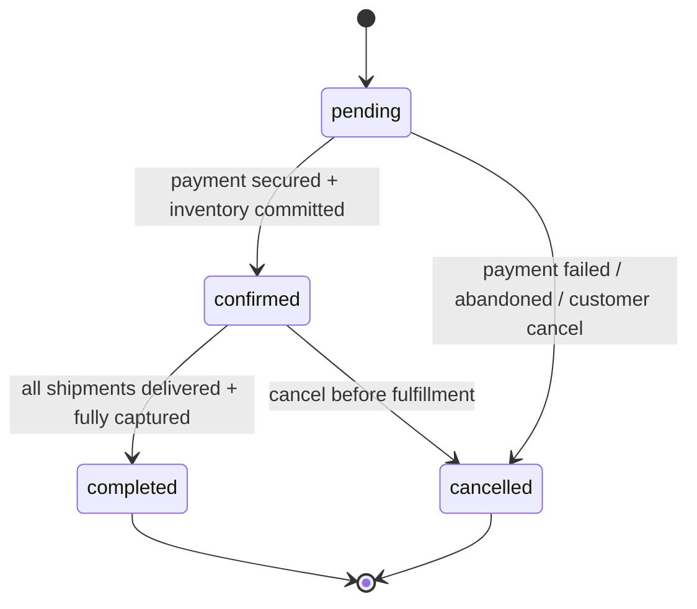
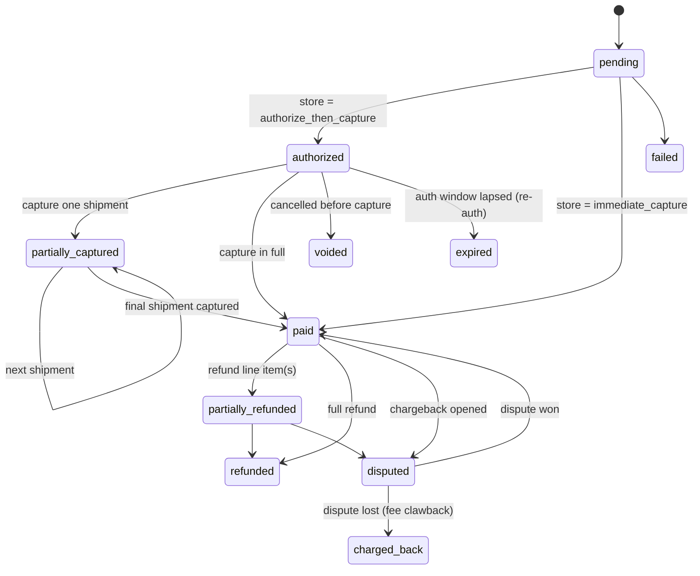

# Backend Engineer

Backend conventions for a **multi-tenant e-commerce marketplace**: dozens of tenants (merchants), each selling to their own customers, on a **shared PostgreSQL database with a `tenant_id` discriminator (pooled model)**. Stack is **NestJS · PostgreSQL · TypeScript · TypeORM**, structured as a **modular monolith**.

Two areas are load-bearing — a mistake becomes a **breach or lock-in**, not a bug — and are marked ⚠️ below.

## Platform facts

- **Isolation:** pooled — shared schema, `tenant_id` on every tenant-scoped table, isolation enforced by PostgreSQL RLS.
- **Scale:** dozens of tenants.
- **Model:** marketplace — merchants sell to their own customers, so split-settlement payments and per-tenant provider choice are first-class.
- **Design constraint:** never assume tenants are permanently co-located — a high-volume tenant can be promoted to its own database later.

*(Rationale and alternatives for these choices live in `docs/architecture/architecture.md`. This skill is the operating manual; the architecture doc is the decision record.)*

## The non-negotiable invariants

Before writing or reviewing backend code, confirm all of these hold:

1. **Every tenant-scoped table has RLS enabled with `FORCE`, and the app connects as a non-owner role.** ⚠️
2. **Tenant context is set transaction-locally via `set_config(..., true)` inside `dataSource.transaction`, through the one central `withTenant` gate — never a bare `SET`, never string-interpolated.** ⚠️
3. **`tenant_id` exists on every tenant-scoped table and is the leading column of composite indexes.**
4. **Every uniqueness rule is composite with `tenant_id` — never a global unique constraint on a merchant-owned value.**
5. **No external-vendor SDK, type, or concept appears outside its adapter.** Domain code depends only on our ports.
6. **Background jobs carry `tenantId` and re-establish tenant context in the worker before any DB access.**

If a change violates any of these, stop and fix the design before proceeding.

## ⚠️ Tenancy isolation (RLS + the context gate)

Isolation is **enforced by PostgreSQL**, not by application `WHERE` clauses. App-level filters stay (they keep the planner using tenant-scoped indexes), but they are defense-in-depth, not the security boundary.

### RLS on every tenant-scoped table

Every tenant-scoped table gets `ENABLE` + `FORCE ROW LEVEL SECURITY` and a policy with both `USING` (guards read/update/delete) and `WITH CHECK` (prevents writing a row into another tenant). The policy **cannot** live in the entity — TypeORM has no policy API. It is declared in a raw-SQL migration alongside (or appended to) that table's `CREATE TABLE` migration — see the worked `orders` example in `docs/architecture/references/d3-orm-typeorm.md` (D3) and the migration skeleton in `docs/architecture/references/d2-rls-enforcement.md` (D2). This is a real process change from a schema-first ORM: the policy is no longer adjacent to the column definitions, so there's no compiler-enforced link between an entity's table name and the migration's `CREATE POLICY ... ON "..."` string — catch drift here in review.

  Use the shared `enableRls(queryRunner, table)` / `disableRls(queryRunner, table)` helpers in `src/db/migrations/helpers/rls.helper.ts` from every tenant-table migration's `up()`/`down()` instead of re-typing the SQL — it's still one explicit call per migration (no magic), just without copy-paste drift. `pnpm db:migrate` runs `pnpm db:verify-rls` afterward as a backstop: it queries `pg_class`/`pg_policies` for every table with a `tenant_id` column and fails the pipeline if any is missing `ENABLE`, `FORCE`, or a policy — it catches a forgotten call, it doesn't replace writing one.

- Prefer a `BEFORE INSERT` trigger that forces `tenant_id = current_setting('app.current_tenant')` so the app can't set it wrong.
- **Roles:** migrations run as the table **owner**; the application runtime uses a **separate, non-owner, non-superuser role**. Without this, `FORCE` aside, RLS silently does nothing. This is the #1 RLS mistake — verify it explicitly.
- **`FORCE` caveat:** TypeORM's `migration:generate` has **no concept of RLS at all** — it will emit `CREATE TABLE` only, never `ENABLE`, `FORCE`, or a policy. All three are manual raw-SQL additions to that migration, every time a tenant-scoped table is created — a strictly bigger manual step than plain "FORCE is the only missing piece." Do not rely on TypeORM to emit any of it.

### The context gate (`withTenant`)

There is **exactly one place** that sets tenant context, and **all tenant-scoped DB access goes through it**. That is a single `withTenant` helper wrapping `dataSource.transaction` from TypeORM, which sets `app.current_tenant` via `set_config(..., true)` before handing the transactional `EntityManager` to the caller. The reference implementation lives in `docs/architecture/references/d2-rls-enforcement.md` (D2).

Why exactly this shape:

- **`set_config(..., true)`, not `SET LOCAL '<id>'`.** `SET` cannot be parameterized, so a `SET LOCAL` gate forces string interpolation of the tenant id — an injection footgun. `set_config`'s third argument `true` makes it transaction-local (equivalent to `SET LOCAL`) *and* accepts a bind parameter. Always use it.
- **Always inside `dataSource.transaction`.** The transaction pins a single connection, so the setting and the queries share it and it clears on commit/rollback. This is the only form safe under PgBouncer transaction pooling.
- **Never a bare `SET` / `set_config(..., false)`.** Pooled connections are reused; a session-scoped value bleeds from one tenant's request into another's, and every following query then passes RLS *for the wrong tenant*. This is the most dangerous bug in the system.
- **Fail closed.** No tenant in context → throw, never run the query. A context-less query is a bug, not a "query all tenants" shortcut.

### How it's wired in NestJS

- Resolve the tenant early in a middleware/guard from **subdomain, custom domain, or JWT claim**; validate it exists and is active.
- Carry it via **`nestjs-cls` (AsyncLocalStorage)**, not request-scoped DI providers (request scope rebuilds the provider tree per request and hurts throughput). `withTenant` reads `tenantId` straight from CLS, so feature code never threads it through method signatures.
- Repositories/services accept the `manager` handed to them by `withTenant` and use it for every query. If a service can inject the raw `DataSource` and query tenant tables without `withTenant`, that is the leak to catch in review.

**Required test:** fire concurrent `withTenant` calls for different tenants through a small pool and assert each only ever sees its own rows — proves zero context bleed.

## Data modeling rules

- **`tenant_id` on every tenant-scoped table**, including child tables reachable by join. This lets RLS protect each table directly and every index be tenant-scoped.
- **Composite indexes lead with `tenant_id`:** `(tenant_id, created_at)`, `(tenant_id, status)`, `(tenant_id, sku)`. A bare index on a non-tenant column is near-useless — the planner still scans across tenants.
- **All uniqueness is composite:**
  - `UNIQUE (tenant_id, sku)` ✅
  - `UNIQUE (sku)` ❌ — cross-merchant collisions *and* an info leak.
  - Audit every unique constraint (SKU, order number, customer email, slug) through this lens.
- **Primary keys are UUIDs (v7 preferred** for index locality) — not per-tenant sequential integers, which leak volume and contend on sequences.

Express all of this via class-level entity decorators (see the `orders` entity example in `docs/architecture/references/d3-orm-typeorm.md`, D3): `@Index(name, ['tenantId', ...])` for tenant-leading composites, `@Unique(name, ['tenantId', ...])` for composite uniqueness. Never write a bare `@Column({ unique: true })` on a merchant-owned column.

## Module / bounded-context conventions

- **Modular monolith.** Do not reach for microservices. NestJS modules map to bounded contexts; keep transactional consistency and low ops overhead. Extract a service later only if one context needs independent scaling.
- **Bounded contexts:** Catalog, Inventory, Cart/Checkout, Orders (as an explicit **state machine**), Payments, Customers, Pricing/Promotions, Shipping/Fulfillment, Tax.
- **Customers belong to a tenant, not the platform** — the same email can be two separate customer records under two merchants.
- **Staff users are many-to-many with tenants**, a role per membership; a staff user may span multiple tenants. Keep platform/staff users separate from storefront customers (different tables, token audiences, RBAC).

## ⚠️ Vendor-agnostic external providers (ports & adapters)

Every external capability — payments, shipping, tax, notifications, storage, search — is integrated through a **provider-agnostic port** owned by the domain, with **adapters** at the edge. No vendor is assumed anywhere.

- **The port speaks our domain language** (`authorize`, `capture`, `refund`, `Money`, `MerchantAccount`), never a vendor's request/response shapes.
- **Adapters translate both directions:** domain calls → vendor API, and vendor callbacks/errors → our normalized internal events and error taxonomy.
- **Provider selection is configuration, resolvable per tenant** — different merchants may use different providers for the same capability.
- **No vendor SDK import outside its adapter.** Enforce via module boundaries / lint; this is the thing to catch in review.

### Payments (the marketplace capability)

Tenants sell to their own customers, so this is a marketplace. The payment port must abstract, provider-neutrally:

- Merchant account **onboarding + identity/KYC** (a merchant can't accept payments until cleared).
- **Split settlement:** funds settle to the merchant; the platform takes a **platform fee**.
- **Callback/webhook attribution:** normalize each inbound event, map it back to the correct **tenant**, and re-establish tenant context before any write.
- **Idempotency at the abstraction layer:** store processed event IDs per tenant so retries never double-fulfill an order — this must hold across providers.
- **Payouts & reconciliation** (orders → charges → platform fees → payouts) and **refunds/disputes** (which can claw back the platform fee — model in the Orders/Payments state machine, not a status flip).

Design the idempotency and callback model against **two hypothetical providers**, not one — a differing callback shape must not force a redesign. This is the part of the abstraction most likely to leak.

### Generic port contract (every port follows this)

- **Domain owns the interface; adapters live at the edge; a registry resolves the adapter per tenant** from config: `registry.forTenant(tenantId) => Port`.
- **`Money` is integer minor units + currency, never a float.**
- **References are opaque `ProviderRef { provider, externalId }` that we persist** — never store a vendor-shaped response blob in a domain table.
- **Every mutating call takes an `idempotencyKey`.**
- **Async providers expose `parseEvent(raw, headers) => NormalizedEvent`** that verifies the signature and returns a `providerEventId` (dedupe key) plus the refs needed for tenant attribution. Verification and normalization live in the adapter; dedupe and `withTenant` happen in the controller.
- **Errors map onto a normalized taxonomy with a `retryable` flag** — feature code never catches a vendor error type.

### Payment port (concrete — Orders depends on it)

The full `PaymentPort` interface (`createMerchantAccount`, `createOnboardingSession`, `getOnboardingStatus`, `authorize`, `capture`, `void`, `refund`, `parseEvent`) and its `NormalizedPaymentEvent` shape are specified in `docs/architecture/references/d7-payment-port.md` (D7). Key points to hold in mind when implementing against it:

- `Money` is integer minor units + currency; `MerchantAccountRef`/`PaymentRef` are opaque `ProviderRef`s we persist.
- `authorize` takes an explicit `autoCapture` flag and a first-class `platformFee`; `capture` supports partial amounts (omit = capture remaining).
- Every mutating method takes an `idempotencyKey`.
- Maps onto the Orders payment dimension: `authorize` → `authorized` (or `captured` when `autoCapture`), `capture(amount)` → `partially_captured`/`paid`, `void` → `voided`, `refund` → `partially_refunded`/`refunded`, dispute events → `disputed`/`charged_back`.
- **Webhook flow:** `parseEvent` → dedupe on `providerEventId` → resolve tenant from `merchantAccount` → `withTenant` → apply order event.

### Other ports (same contract; specify interface-by-interface when built)

- **ShippingPort** — `getRates(parcel, from, to)`, `buyLabel(rate, idempotencyKey) => { labelUrl, trackingNumber, carrierRef }`; `parseEvent` yields tracking updates (`in_transit`/`delivered`/`exception`) that feed the shipment machine.
- **TaxPort** — `quote(cart, addresses) => TaxBreakdown`, plus `commit(orderId)` / `adjust(orderId, refundedLines)`. Model commit/adjust even if your first provider is stateless, so a transactional provider (which needs commit/void) can be swapped in without redesign.
- **NotificationPort** — `send(channel, templateId, to, vars, idempotencyKey)` across email/SMS/push; `parseEvent` for delivery/bounce.
- **StoragePort** — `put(key, bytes)`, `getSignedUrl(key, ttl)`, `delete(key)`; **keys must be tenant-namespaced** (`tenant/{id}/...`).
- **SearchPort** — `index(entity)`, `query(tenantId, q, filters)`, `delete(id)`. ⚠️ External search engines have **no RLS**, so the port itself MUST enforce tenant scoping (per-tenant index or a mandatory tenant filter) — this is the DB tenancy gate's analogue for search, and forgetting it is the same class of leak.

## Orders state machine

An order is **not** one flat `status` enum. It carries three concerns that change on independent timelines, modeled as **three coordinated sub-machines persisted as separate columns**, plus a per-shipment entity. Cramming them into one enum produces either a combinatorial explosion or lossy state (an order can be *paid but unfulfilled*, *fulfilled then partially refunded*, or *delivered then disputed weeks later*).

Settled design parameters: **capture timing is per-store config** (`captureMode = 'authorize_then_capture' | 'immediate'`); **fulfillment is partial / multi-shipment per line item**; **one platform-standard flow** for all merchants (skippable states cover digital goods).

### Dimension 1 — lifecycle (`status`), one standard flow

Stays lean on purpose: money and shipping detail live in the other two dimensions, so post-completion events (a late refund or dispute) need **no new lifecycle states**.

### Dimension 2 — payment (`payment_status`), supports both capture modes

`partially_captured` exists specifically because per-store authorize-then-capture + multi-shipment means you capture as each shipment goes out. On `immediate_capture` stores, `pending → paid` at checkout and shipments trigger no captures. All payment transitions are driven by **normalized events from the payment port**, never vendor-specific ones.

### Dimension 3 — fulfillment (`fulfillment_status`), derived from shipments

Fulfillment is tracked on a `shipments` sub-entity (each referencing line items + quantities), each running: `pending → shipped → delivered`, plus `returned`. The order's `fulfillment_status` is **derived by aggregation**: `unfulfilled` (no shipments shipped) → `partially_fulfilled` (some quantity shipped) → `fulfilled` (all shipped), with `partially_returned` / `returned` on the return path. Do not set `fulfillment_status` directly; recompute it from shipments inside the transition.

### Transition side effects (must run in the same transaction as the state change)

| Transition | Side effects |
|---|---|
| `pending → confirmed` | Commit inventory reservation; on `authorize_then_capture` the auth already exists, on `immediate_capture` funds already captured |
| Create + ship a shipment | Allocate stock; on `authorize_then_capture`, capture that shipment's amount via the payment port (funds route to merchant minus platform fee) → payment advances toward `partially_captured` / `paid` |
| All shipments delivered + fully captured | `confirmed → completed` |
| Cancel before fulfillment | Release inventory; `authorized → voided` or refund a captured amount; `→ cancelled` |
| Refund line item(s) | `→ partially_refunded` / `refunded`; claw back proportional platform fee via the port |
| Dispute event from port | `→ disputed`; possible fee clawback; lifecycle unchanged |

### Implementation rules

- **The machine is a pure domain function** — `(state, event) => nextState | IllegalTransition` — with an explicit transition table per dimension, living in the Orders context, unit-testable with no database. Persistence and `withTenant` wrap around it, never inside it.
- **Guard every transition.** Illegal transitions are rejected, not silently applied. Consider a DB `CHECK`/trigger as a backstop, but the domain layer is the primary guard.
- **Event-driven + idempotent.** Every transition is recorded in an append-only `order_events` table `(tenant_id, order_id, from_state, to_state, dimension, event_type, actor, provider_event_id, payload, occurred_at)`. This is both the **audit trail** (essential for dispute/reconciliation defense) and the **idempotency key**: `unique (tenant_id, provider_event_id)` so a redelivered provider event is a no-op. Reuse the same dedupe the payment port enforces.
- **Everything tenant-scoped.** `orders`, `shipments`, and `order_events` all carry `tenant_id` with RLS + `FORCE`; every transition runs inside `withTenant`.
- **The order machine emits, it does not own payouts.** Capture/refund/clawback effects are requested through the payment port; payout scheduling and reconciliation consume the emitted events.

## Cross-cutting concerns (contain the pooled model's blast radius)

The accepted cost of pooling is noisy neighbors. Make every shared resource tenant-aware:

- **Cache keys are tenant-prefixed:** `tenant:{id}:product:{id}`. No shared keys.
- **Rate limiting is per-tenant**, not just global, so one merchant can't starve the pool.
- **Background jobs (BullMQ):** every payload carries `tenantId`; the worker re-establishes the `SET LOCAL` context before any DB access. A context-less job fails RLS or leaks.
- **Observability:** tag every log line, metric, and trace span with `tenant_id` (debugging shared tables, billing attribution, catching noisy neighbors).
- **Config / feature flags are per-tenant** from day one (tax rules, currencies, enabled features).
- **Escape hatch:** don't assume tenants are permanently co-located — leave room to promote a whale tenant to its own database later.

## Related skills

- **`rest-api-design`** — resource naming, HTTP methods/status codes, versioning, pagination, and OpenAPI docs for any HTTP endpoints built on top of these backend conventions.

## Pre-merge review checklist

Run through this on any backend change touching tenant data or providers:

- [ ] New tables: `tenant_id` present; `ENABLE` + `FORCE ROW LEVEL SECURITY` + `CREATE POLICY` (`USING` + `WITH CHECK`) all present as raw SQL in the migration — TypeORM emits none of this automatically.
- [ ] Runtime DB role is non-owner / non-superuser; policy `TO` targets that role.
- [ ] Every `TypeOrmModule` DataSource config has `synchronize: false` — never rely on auto-sync in an RLS-governed schema; it has zero RLS awareness and would fight migrations.
- [ ] All tenant-scoped DB access goes through `withTenant`; no service injects the raw `DataSource` for tenant tables; context set via `set_config(..., true)`, never bare `SET` or interpolation.
- [ ] Composite indexes lead with `tenant_id`; no bare non-tenant indexes on hot paths.
- [ ] Every unique constraint includes `tenant_id` (no bare `.unique()` on merchant-owned columns).
- [ ] No vendor SDK/type imported outside its adapter; new providers implement an existing port; every mutation passes an `idempotencyKey`.
- [ ] Non-DB shared resources are tenant-scoped too: search queries filtered by tenant (no RLS there), storage keys tenant-namespaced.
- [ ] New background jobs carry `tenantId` and set context in the worker.
- [ ] Cache keys, rate limits, logs/metrics are tenant-scoped.
- [ ] Order state changes go through the guarded transition function, write an `order_events` row, and set `status` / `payment_status` / (derived) `fulfillment_status` — never a raw status update; provider-driven transitions dedupe on `(tenant_id, provider_event_id)`.
- **Provider port catalogue** (payments first, then shipping, tax, notifications, storage, search) to be specified interface-by-interface.