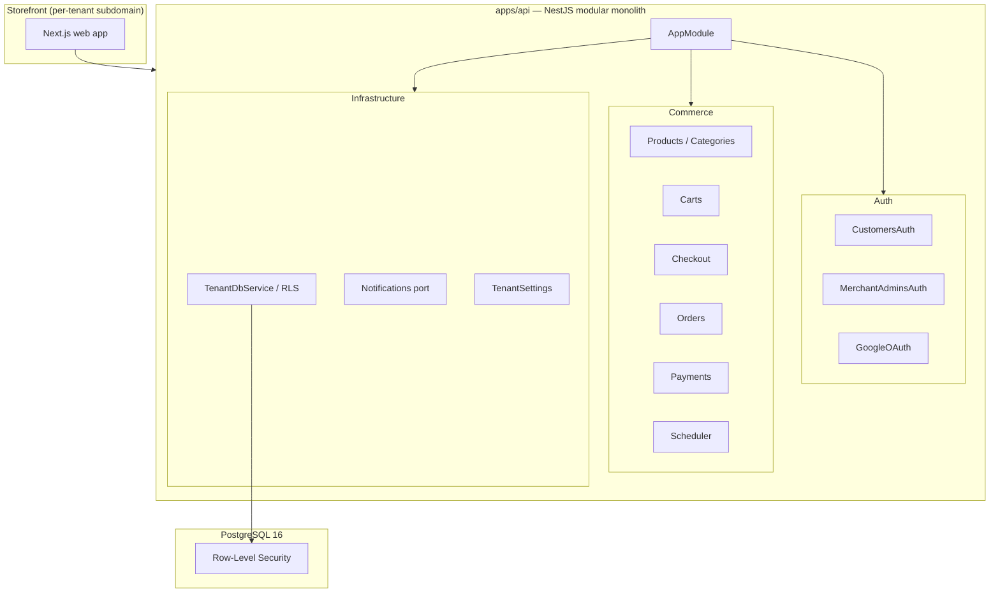

# Backend Architecture — Tiny Threads

Tiny Threads is a **multi-tenant e-commerce marketplace**: dozens of merchant
tenants, each selling to their own customers. This document describes the
as-built backend architecture of `apps/api`. Its companion is the
**`backend-engineer` skill** (`.agents/skills/backend-engineer/SKILL.md`),
which is the operating manual — the rules engineers follow day-to-day. This
document explains why those rules exist.

---

## System overview



The API is a **modular monolith**: one NestJS process whose modules map onto
bounded contexts. This keeps transactional consistency (order + payment +
stock side-effects in one DB transaction) and low operational overhead. A
context can be extracted to an independent service later if it needs
independent scaling — the module boundaries are the extraction seams.

Schema-per-tenant and database-per-tenant were considered and rejected at
this scale, though database-per-tenant remains the escape hatch for a high-
volume tenant. Microservices from the start were also rejected — premature
at this scale, adding distributed-transaction and ops complexity with no
offsetting benefit.

---

## Multi-tenancy

### Model: pooled shared schema

All tenants share one PostgreSQL schema. Every tenant-scoped table carries a
`tenant_id` column. This gives a single migration path, one connection pool,
and easy cross-tenant reporting — the tradeoffs being shared CPU/connections
and noisy-neighbour risk, contained by per-tenant rate limits, cache keys, and
job context.

The scheme is not permanent: a high-volume tenant can be moved to its own
database without changing the application (the `tenant_id` column stays, the
RLS policy stays, only the connection string changes).

### Isolation: PostgreSQL Row-Level Security

Application `WHERE` clauses alone cannot be the isolation boundary under a
shared connection pool — one omission in one code path is a breach.
PostgreSQL RLS is the enforced backstop:

```sql
ALTER TABLE orders ENABLE ROW LEVEL SECURITY;
ALTER TABLE orders FORCE  ROW LEVEL SECURITY;  -- owner role bypasses RLS without FORCE
CREATE POLICY tenant_isolation ON orders
  USING      (tenant_id = current_setting('app.current_tenant', true)::uuid)
  WITH CHECK (tenant_id = current_setting('app.current_tenant', true)::uuid);
```

`missing_ok = true` means an unset `app.current_tenant` GUC returns `NULL`,
which fails the equality check — unset context is **fail-closed**, not
fail-open.

Two caveats that must both hold for RLS to actually enforce isolation:

1. **`FORCE`** is required. Without it, the table owner (used for migrations)
   bypasses RLS silently.
2. **A non-owner runtime role** is required. The application connects as
   `app_runtime` (granted `SELECT/INSERT/UPDATE/DELETE`, no DDL,
   `NOSUPERUSER NOBYPASSRLS`). Migrations run as `app_owner` (owns the
   schema, also `NOBYPASSRLS`). Pointing the application's `DATABASE_URL`
   at `app_owner` would bypass RLS on every query — never do this.

Application-only filtering was rejected as the primary boundary (unsafe under
pooling); request-scoped DI for tenant context was rejected (rebuilds provider
tree per request, hurts throughput); session-scoped `SET` was rejected (leaks
context across pooled connections under PgBouncer transaction mode).

### The tenant context gate: `TenantDbService`

Tenant context is set **transaction-locally** — never as a session-level `SET`
(which bleeds across pooled connections under PgBouncer transaction mode):

```ts
// The only gate. Feature code never touches DataSource directly for tenant data.
export async function withTenant<T>(
  dataSource: DataSource,
  cls: ClsService,
  work: (manager: EntityManager) => Promise<T>,
): Promise<T> {
  const tenantId = cls.get<string>('tenantId');
  if (!tenantId) throw new Error('withTenant called with no tenant in context');

  return dataSource.transaction(async (manager) => {
    // set_config(..., true) = SET LOCAL: scoped to this transaction, discarded on COMMIT/ROLLBACK.
    // PARAMETERIZED — never string-interpolated — to prevent injection.
    await manager.query(`select set_config('app.current_tenant', $1, true)`, [tenantId]);
    return work(manager);
  });
}
```

All domain code calls `TenantDbService.run(work)` (which wraps `withTenant`).
Direct `DataSource` or `EntityManager` injection is prohibited for any
tenant-scoped operation.

### Tenant resolution: `TenantResolutionMiddleware`

`withTenant` reads `tenantId` from CLS (AsyncLocalStorage). Something must
populate CLS before any tenant DB call. That something is
**`TenantResolutionMiddleware`** — the sole populator for ordinary requests.

It resolves the tenant by exact match of the lowercased `Host` header against
`tenants.host`, and `404`s on no match. The host is never taken from a request
body or query param — a client-supplied tenant id would let any client forge
the RLS context.

Because the lookup is an exact match against a real row, there is no separate
"is this host trustworthy" step — an attacker-forged `Host` either matches a
genuine tenant's registered host (in which case it is the same origin a
legitimate request would use) or it matches nothing and gets the same `404`
as an unknown tenant.

The middleware is mounted `forRoutes('*')` with a small deliberate exclusion
list (see `apps/api/src/app/app.module.ts`). Current exclusions:

| Route | Reason |
|---|---|
| `GET /auth/google/callback` | Platform-domain route; Google only allows one registered redirect URI. Sets CLS itself from the HMAC-signed OAuth `state`. |
| `POST /api/v1/payments/webhook` | Global webhook; resolves tenancy from the verified provider event's `merchantAccount`. |
| `GET /` | Health probe. Arrives by IP or internal DNS — resolves to no tenant host and would `404` every probe. Touches no tenant data. |

Any route excluded from this middleware has an **unvalidated** `req.hostname`
and must not use it as a security input. The OAuth `returnUrl` origin check
(`apps/api/src/common/utils/return-url.ts`) pins redirect targets to
`req.hostname` — this is sound **only** because the middleware ran first.
Adding another exclusion requires updating this doc and the `backend-engineer`
skill in the same change.

There is no tenant-provisioning API today — tenant `host` values are inserted
manually. Any future self-service provisioning will need domain-ownership
verification and a reserved-host denylist before it ships.

---

## Data layer

### ORM: TypeORM

TypeORM with the `pg` driver via `@nestjs/typeorm`. Chosen for NestJS-ecosystem
fit and first-party integration. Entities describe columns and constraints only;
TypeORM has no declarative RLS API, so `ENABLE ROW LEVEL SECURITY`, `FORCE ROW
LEVEL SECURITY`, and the tenant policy are declared exclusively in raw-SQL
migrations — never in the entity.

Drizzle (SQL-first, good RLS support, but lighter NestJS-ecosystem footprint)
and Prisma (ergonomic but hides SQL, working against auditing the isolation
boundary) were considered and rejected.

Every new tenant-scoped table follows a two-step pattern in its migration:

```ts
// up()
await queryRunner.query(`CREATE TABLE "orders" (...)`);
await enableRls(queryRunner, 'orders');  // helper: ENABLE + FORCE + CREATE POLICY + verify

// down()
await disableRls(queryRunner, 'orders');
await queryRunner.query(`DROP TABLE "orders"`);
```

The `enableRls` helper re-reads `pg_catalog` in the same transaction to assert
all three statements took effect. A broken call fails the whole migration
(and its `CREATE TABLE`) rather than shipping an unprotected table.

**Gotcha:** there is no compiler-enforced link between an entity's
`@Entity({ name: ... })` table name and the raw-SQL `CREATE POLICY ... ON
"..."` string in its migration. Renaming a table means remembering to update
the migration by hand — catch this in review.

### Entity base classes

| Class | PK | `tenant_id` | Timestamps | When to use |
|---|---|---|---|---|
| `TenantEntityBase` | `(tenant_id, id)` uuidv7 | ✓ | `created_at`, `updated_at` | Most tenant-scoped entities |
| `ImmutableTenantEntityBase` | `(tenant_id, id)` uuidv7 | ✓ | `created_at` only | Append-only tenant tables (events, tokens) |
| `EntityBase` | `id` uuidv7 | — | `created_at`, `updated_at` | Non-tenant shared entities (e.g. `tenants`) |
| `ImmutableEntityBase` | `id` uuidv7 | — | `created_at` only | Non-tenant append-only entities |
| `CreatedAtEntityBase` | `id` uuidv7 | — | `created_at` only | Simple shared timestamped entities |

PK generation uses `uuidv7` (monotonically increasing UUID) for index locality
via a `@BeforeInsert` hook. Every FK between tenant-scoped tables is
**composite** — it carries `tenant_id` alongside `id`, making a cross-tenant
reference physically impossible at the database level.

### Migration safety rules

1. Timestamp prefixes must be strictly ascending across all migration files.
2. The exported class name and its `name` property must match the filename
   timestamp exactly.
3. No `DROP TABLE` in `up()` unless the table is created in the same `up()`.

These rules are verified statically by `migration-order.spec.ts` on every test
run. `pnpm db:verify-fresh` proves the full migration chain runs on a clean
database from zero. `pnpm db:verify-rls` checks policies after every
`db:migrate`.

---

## Vendor abstraction: ports & adapters

Every external capability (payments, shipping, tax, notifications, storage,
search) is a **domain-owned port** with **adapters** at the edge. A
**`*Registry`** resolves the per-tenant adapter from configuration at runtime.

Shared contract across all ports:
- Money as integer minor units paired with an uppercase ISO-4217 currency string.
- Opaque `ProviderRef { provider, externalId }` persisted by us — no vendor
  blobs in domain tables.
- An `idempotencyKey` on every mutation.
- Async providers expose `parseEvent → NormalizedEvent` with a `providerEventId`
  for deduplication and refs for tenant attribution.
- Normalized error taxonomy with a `retryable` flag.

Vendor SDKs and vendor-specific types must never appear in domain services or
controllers. Swapping an adapter means adding one class and rebinding one DI
token — no domain code changes.

Vendor SDKs directly in domain code were rejected (lock-in, leaked types). A
single fixed provider per capability was rejected (incompatible with per-tenant
choice). Note: external search has no RLS, so any `SearchPort` must enforce
tenant scoping itself.

### Implemented ports

| Capability | Port | Adapter(s) |
|---|---|---|
| Transactional email | `NotificationsPort` (`notifications/notifications-port.ts`) | `LogNotificationsAdapter` (logs the send; redacts `*token*` data keys so log access cannot hijack an account) |
| Payments | `PaymentPort` (`payments/interfaces/payment-port.interface.ts`) | `MockPaymentProvider` (dev/test) |

Shipping, tax, storage, and search remain designed-but-unimplemented ports.
See [`payments.md`](payments.md) for the full `PaymentPort` contract.

---

## Commerce domain

### Orders: three coordinated state machines

An order carries three independently-changing concerns modeled as three
separate columns — not one flat status enum:

| Column | States | Driven by |
|---|---|---|
| `status` (lifecycle) | `pending → confirmed → completed`, `cancelled` as the pre-completion exit | Merchant admin actions, payment events, expiry |
| `payment_status` | `pending → authorized → paid → refunded`; also `partially_captured`, `partially_refunded`, `voided`, `failed`, `disputed`, `charged_back` | Payment port events |
| `fulfillment_status` | `unfulfilled → partially_fulfilled → fulfilled` | Derived from `shipments` records |

The lifecycle machine is a pure guarded function `(state, event) → nextState |
IllegalTransition`. Every transition appends an `order_events` row (audit
trail); `unique(tenant_id, provider_event_id)` doubles as webhook idempotency
key. Side effects (stock restoration, payment refund) run in the same
transaction as the status update.

A single flat `status` enum, immediate-capture-only flows, and
single-shipment-only flows were all rejected — they collapse under real
multi-step commerce.

See [`orders.md`](orders.md) for the checkout flow, expiry scheduler, guest
order access, and cancellation side-effects.

### Marketplace payments: split settlement via a payment port

A provider-agnostic `PaymentPort` covers merchant onboarding, split-settlement
money movement, and normalized inbound webhook events. The platform takes a fee
(`platformFeePercent`) computed at checkout; the remainder goes to the
merchant. Refunds can claw back the platform fee.

The `MockPaymentProvider` implements `PaymentPort` for dev and tests.
`PaymentPortRegistry` resolves the per-tenant provider adapter at runtime.

```ts
interface Money { amount: number; currency: string }            // integer MINOR units
interface ProviderRef { provider: string; externalId: string }  // we persist this
type MerchantAccountRef = ProviderRef;
type PaymentRef = ProviderRef;

interface PaymentPort {
  createMerchantAccount(i: { tenantId: string; profile: BusinessProfile; idempotencyKey: string }): Promise<MerchantAccountRef>;
  createOnboardingSession(a: MerchantAccountRef, returnUrl: string): Promise<{ url: string; expiresAt: Date }>;
  getOnboardingStatus(a: MerchantAccountRef): Promise<'pending'|'needs_information'|'active'|'rejected'|'disabled'>;

  authorize(i: {
    merchantAccount: MerchantAccountRef; amount: Money; platformFee: Money;
    paymentMethodToken: string; orderId: string;
    autoCapture: boolean;                 // true on immediate_capture stores
    idempotencyKey: string;
  }): Promise<{ paymentRef: PaymentRef; state: 'authorized'|'captured'|'failed'; authExpiresAt?: Date }>;

  capture(i: { payment: PaymentRef; amount?: Money; idempotencyKey: string }): Promise<{ state: 'partially_captured'|'captured'; capturedTotal: Money }>;
  void(payment: PaymentRef, idempotencyKey: string): Promise<void>;
  refund(i: { payment: PaymentRef; amount?: Money; refundPlatformFee: boolean; reason?: string; idempotencyKey: string }): Promise<{ refundRef: ProviderRef; refundedTotal: Money }>;

  parseEvent(raw: Buffer, headers: Record<string, string>): Promise<NormalizedPaymentEvent>;
}

interface NormalizedPaymentEvent {
  providerEventId: string;              // → unique(tenant_id, provider_event_id)
  type: 'payment.authorized'|'payment.captured'|'payment.refunded'
      | 'payment.dispute.opened'|'payment.dispute.won'|'payment.dispute.lost'
      | 'payout.paid'|'merchant_account.updated';
  merchantAccount: MerchantAccountRef;  // → resolve tenant, then withTenant(...)
  payment?: PaymentRef;
  occurredAt: Date;
}
```

Funds through the platform account then payout were rejected (worse
regulatory/reconciliation posture). Coupling to one gateway's API was rejected
(lock-in).

See [`payments.md`](payments.md) for the full contract, settlement formula, and
webhook idempotency design.

---

## Domain design references

As-built references for each shipped domain:

| Domain | Reference |
|---|---|
| Authentication | [`authentication.md`](authentication.md) |
| Error handling | [`error-handling.md`](error-handling.md) |
| Products & categories | [`products-and-categories.md`](products-and-categories.md) |
| Carts & customer addresses | [`carts-and-addresses.md`](carts-and-addresses.md) |
| Orders | [`orders.md`](orders.md) |
| Payments | [`payments.md`](payments.md) |
| Database conventions | [`database-conventions.md`](database-conventions.md) |
| Database schema (ERD) | [`database-schema.md`](database-schema.md) |
