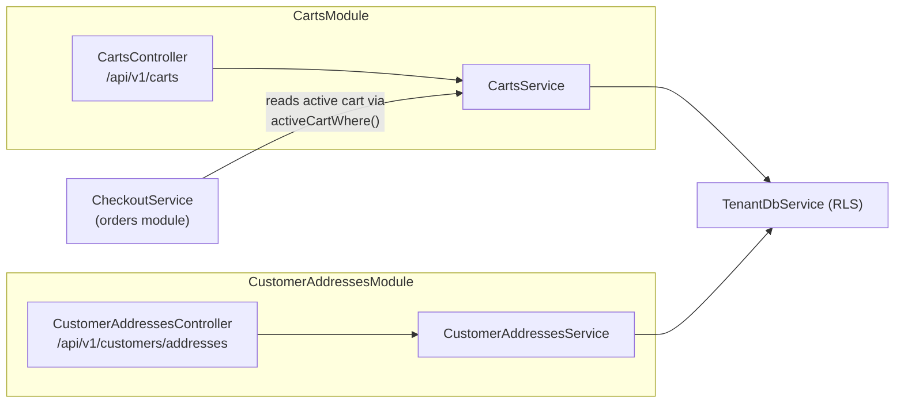
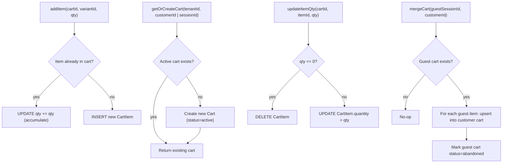

# Carts & Customer Addresses — design reference

As-built reference for cart persistence and customer address management in
`apps/api`. See `docs/architecture/architecture.md` for the multi-tenancy
and RLS foundations, and `docs/architecture/orders.md` for how the checkout
engine consumes carts.

## 1. Shape of the system



`CheckoutService` consumes `CartsService` to resolve the active cart at
checkout time. It does not own the cart — `CartsService` is the single owner.

## 2. Cart model

| Entity | Table | Notable columns |
|---|---|---|
| `Cart` | `carts` | `customerId` (nullable — null for guest carts), `sessionId` (UUID, used for guest carts), `status` (`active\|abandoned\|converted`) |
| `CartItem` | `cart_items` | `cartId`, `variantId`, `quantity`, `unitPrice` (snapshot) |

Both tables are tenant-scoped with composite PKs `(tenant_id, id)`.

Key indexes:
- `carts`: `(tenant_id, customerId)` for authenticated lookups; `(tenant_id, sessionId)` for guest lookups
- `cart_items`: `(tenant_id, cartId, variantId)` for upsert logic

A cart transitions through statuses: `active` (in use) → `abandoned` (guest
cart after login merge, or expiry) → `converted` (checkout completed). Only
`active` carts participate in checkout.

## 3. Guest session protocol

Guests do not authenticate, but need a stable cart identity across requests.
The protocol:

1. Client sends `X-Guest-Session-ID: <uuid>` on every request.
2. If the header is absent on a cart-creating request, the server generates a
   UUID and echoes it in `X-Guest-Session-ID` on the response.
3. All subsequent cart operations from the guest must include the same header.
4. No authentication is required for any cart read or write.

The session ID is an opaque identifier — it carries no claims and confers no
privileges beyond accessing that specific guest cart within the tenant.

## 4. Cart lifecycle



`getOrCreateCart` is idempotent — it finds the single `active` cart for the
customer or session, or creates one. Duplicate active carts cannot exist
because the lookup runs inside a `tenantDb.run` transaction.

At login, `mergeCart` is called with the guest's session ID and the newly
authenticated customer ID. Guest cart items are folded into the customer's
active cart (creating the customer cart if needed), and the guest cart is
marked `abandoned`.

## 5. Cart-checkout security (IDOR prevention)

The checkout flow never accepts a `cartId` from the client. Instead, the active
cart is resolved from the caller's credentials:

```ts
// For authenticated customers: derive from JWT sub
activeCartWhere(tenantId, { customerId: jwtPayload.sub })

// For guests: derive from X-Guest-Session-ID header
activeCartWhere(tenantId, { sessionId: req.headers['x-guest-session-id'] })
```

A client supplying an arbitrary `cartId` would be able to check out against
another customer's cart — an IDOR vulnerability. Deriving the cart from
verified credentials (JWT sub or session header issued by the server) closes
this.

## 6. Customer addresses

| Entity | Table | Notable columns |
|---|---|---|
| `CustomerAddress` | `customer_addresses` | `customerId`, `line1`, `line2`, `city`, `state`, `postalCode`, `countryCode`, `isDefaultShipping`, `isDefaultBilling` |

At most one address per customer may have `isDefaultShipping = true`, and at
most one may have `isDefaultBilling = true`. When a new default is set:

1. A transaction begins.
2. All existing addresses for the customer have the relevant flag set to
   `false` via a bulk `UPDATE`.
3. The target address has the flag set to `true`.
4. The transaction commits.

This ensures the single-default invariant cannot be violated even under
concurrent requests.

`countryCode` is validated against the `countries` global reference table at
the service layer. An unrecognised code throws `INVALID_COUNTRY_CODE` before
any write.

## 7. API surface

### Cart endpoints

| Method | Path | Auth | Description |
|---|---|---|---|
| `GET` | `/api/v1/carts` | Optional JWT or guest session | Get or create active cart |
| `POST` | `/api/v1/carts/items` | Optional JWT or guest session | Add item to cart |
| `PATCH` | `/api/v1/carts/items/:itemId` | Optional JWT or guest session | Update item quantity (0 = remove) |
| `DELETE` | `/api/v1/carts/items/:itemId` | Optional JWT or guest session | Remove item from cart |
| `POST` | `/api/v1/carts/merge` | Customer JWT | Merge guest cart into authenticated cart |

### Customer address endpoints

| Method | Path | Auth | Description |
|---|---|---|---|
| `GET` | `/api/v1/customers/addresses` | Customer JWT | List addresses |
| `POST` | `/api/v1/customers/addresses` | Customer JWT | Create address |
| `PATCH` | `/api/v1/customers/addresses/:id` | Customer JWT | Update address |
| `DELETE` | `/api/v1/customers/addresses/:id` | Customer JWT | Delete address |
| `PATCH` | `/api/v1/customers/addresses/:id/default-shipping` | Customer JWT | Set as default shipping |
| `PATCH` | `/api/v1/customers/addresses/:id/default-billing` | Customer JWT | Set as default billing |

## 8. Error codes

| Code | When |
|---|---|
| `CART_NOT_FOUND` | Cart ID not found in this tenant for this customer/session |
| `CART_ITEM_NOT_FOUND` | Cart item ID not found in this cart |
| `INVALID_CART_QUANTITY` | Quantity is not a positive integer |
| `PRODUCT_VARIANT_NOT_FOUND` | Variant ID not found or not active |
| `ADDRESS_NOT_FOUND` | Address ID not found in this tenant for this customer |
| `INVALID_COUNTRY_CODE` | `countryCode` not in the `countries` reference table |

## Related

- `docs/architecture/architecture.md` — tenancy model and RLS
- `docs/architecture/products-and-categories.md` — `product_variants` referenced by cart items
- `docs/architecture/orders.md` — checkout consumes carts via `activeCartWhere`
- `docs/architecture/error-handling.md` — error envelope format
- `.agents/skills/backend-engineer/SKILL.md` — operating rules
