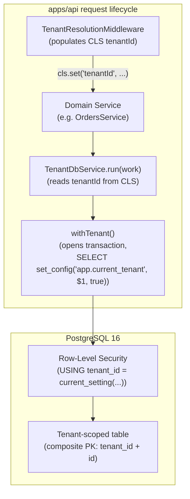

# Database Conventions — design reference

As-built reference for the data-layer patterns shared across all domain modules
in `apps/api`. `apps/api/GEMINI.md §4` carries the **rules** (what engineers must do);
this document carries the **rationale** (why the rules exist and what happens
when they are violated). See `docs/architecture/architecture.md` for the
multi-tenancy and RLS foundations these conventions build on.

## 1. Shape of the system



## 2. Entity base classes

Every entity in `apps/api` extends one of five base classes. The choice is
determined by whether the entity is tenant-scoped and whether rows are ever
updated after insert.

| Class | PK | `tenant_id` | Timestamps | When to use |
|---|---|---|---|---|
| `TenantEntityBase` | `(tenant_id, id)` uuidv7 | ✓ | `created_at`, `updated_at` | Most tenant-scoped entities (products, orders, carts, …) |
| `ImmutableTenantEntityBase` | `(tenant_id, id)` uuidv7 | ✓ | `created_at` only | Append-only tenant tables (events, tokens, refresh tokens) |
| `EntityBase` | `id` uuidv7 | — | `created_at`, `updated_at` | Non-tenant shared mutable entities (e.g. `tenants`) |
| `ImmutableEntityBase` | `id` uuidv7 | — | `created_at` only | Non-tenant append-only entities |
| `CreatedAtEntityBase` | `id` uuidv7 | — | `created_at` only | Simple shared timestamped entities |

**PK generation.** All `id` columns use `uuidv7` (monotonically increasing,
time-sortable UUID), generated in a `@BeforeInsert` hook:

```ts
@BeforeInsert()
generateId() {
  this.id ??= uuidv7();
}
```

`uuidv7` preserves insert-order locality in the B-tree index — new rows land
at the end of the leaf page rather than at random positions, reducing page
splits and improving cache efficiency versus random UUIDv4.

## 3. RLS pattern

### The gate: `TenantDbService.run()`

All tenant-scoped DB access must go through `TenantDbService.run(work)`, which
calls `withTenant` under the hood. This function:

1. Reads `tenantId` from CLS (AsyncLocalStorage).
2. Opens a TypeORM transaction (single connection, single `BEGIN`).
3. Issues `SELECT set_config('app.current_tenant', $1, true)` with the tenant
   ID as a bind parameter — this is `SET LOCAL` but **parameterized**.
4. Runs `work(manager)`.
5. Commits or rolls back.

```ts
await manager.query(
  `select set_config('app.current_tenant', $1, true)`,
  [tenantId],   // ← parameterized, never interpolated
);
```

**Why parameterized?** A bare `SET LOCAL app.current_tenant = '${tenantId}'`
would be an injection footgun if `tenantId` ever came from user input (even
if the middleware validates it against the DB, defense in depth applies). The
parameterized form is injection-safe by construction.

**Why `true` (transaction-local)?** The third argument to `set_config` makes
the setting expire at `COMMIT`/`ROLLBACK`. Without it (`SET SESSION`), the
GUC would persist on the connection and leak to the next query if the
connection is returned to the pool before the session GUC is cleared — a
breach under PgBouncer transaction-mode pooling.

### Composite PKs and FKs

Every tenant-scoped table has a composite PK `(tenant_id, id)`. Every FK
between two tenant-scoped tables is also composite — it carries both
`(tenant_id, referenced_id)`. This makes a cross-tenant reference physically
impossible at the DB level (the FK constraint would reject it) rather than
relying on application code.

### `app_owner` must never be the runtime connection

`app_owner` owns the schema and is used exclusively for migrations. It also has
`NOBYPASSRLS` — it is not a superuser. However, it is the *owner* of the
tables, and table owners bypass RLS unless `FORCE ROW LEVEL SECURITY` is
active. `FORCE` is enabled on all tenant-scoped tables, which means even
`app_owner` queries are subject to the policy — but only when `app.current_tenant`
is set. Migrations run as `app_owner` with no tenant context, so the GUC is
unset, and `missing_ok = true` returns `NULL`, failing the policy. This is
fine for DDL. But if the application's `DATABASE_URL` ever pointed at
`app_owner`, every runtime query would connect as the owner and the intent of
the roles would be violated — even if `FORCE` protects you in theory, the
separation of DDL and DML roles is a structural guarantee not a per-query one.

## 4. Migration rules

### Timestamp ordering

Migration filenames must have strictly ascending timestamps:
```
1722374400000-CreateTenantsTable.ts
1722374401000-CreateMerchantUsersTable.ts
```

Gaps are fine; going backward is not. The order of migration execution is the
alphabetical order of filenames, which is the timestamp order.

### Class name and `name` property must match the filename

```ts
// File: 1722374400000-CreateTenantsTable.ts
export class CreateTenantsTable1722374400000 implements MigrationInterface {
  name = 'CreateTenantsTable1722374400000';
  ...
}
```

A mismatch between the filename timestamp and the `name` property causes
TypeORM to register the migration under the wrong key, leading to replays or
skips. `migration-order.spec.ts` enforces this statically.

### No `DROP TABLE` in `up()` unless the table is created in the same `up()`

A `DROP TABLE` in a migration's `up()` that references a table created by an
earlier migration is irreversible without `db:revert` and destroys production
data. The rule: an `up()` may only `DROP TABLE` a table it `CREATE TABLE`d in
the same `up()` (rollback of a just-created table). `migration-order.spec.ts`
enforces this statically.

### Verification scripts

```bash
pnpm db:verify-fresh   # Run full migration chain on an empty DB; fails on any error
pnpm db:verify-rls     # Check that every tenant-scoped table has ENABLE + FORCE + policy
```

`db:verify-rls` is run automatically after `db:migrate`. If a new tenant table
is added without calling `enableRls(queryRunner, table)` in its migration,
`db:verify-rls` fails and blocks CI.

## 5. Index conventions

### Every tenant-scoped entity needs at least one composite index

The PK `(tenant_id, id)` is used for point lookups by ID. Application queries
almost always need a different access pattern (e.g. list orders by customer,
list products by status). At least one non-PK index per tenant-scoped entity
is required.

### All composite indexes must lead with `tenant_id`

```ts
@Index('orders_tenant_created_idx', ['tenantId', 'createdAt'])  // ← tenantId leads
```

Without `tenant_id` as the leading column, an index on `createdAt` alone would
be usable by queries from all tenants — a full-table scan filtered by RLS is
less efficient than an index scan scoped to one tenant. With `tenant_id`
leading, the planner can prune to one tenant's rows before scanning.

`entity-metadata.spec.ts` enforces the tenant-leading rule statically. A
composite index on a tenant-scoped entity whose first column is not `tenantId`
fails the test suite.

### Naming convention

```
<table>_tenant_<field>_idx
```

Examples:
- `orders_tenant_created_idx` (`tenant_id`, `created_at`)
- `products_tenant_status_idx` (`tenant_id`, `status`)

## 6. Numeric transformer pattern

PostgreSQL `numeric` columns are returned as strings by the `pg` Node.js
driver. A column declared as:

```ts
@Column({ type: 'numeric', precision: 10, scale: 2 })
price!: number;
```

will receive `"19.99"` (a string) at runtime, not `19.99`. Always add a
`transformer`:

```ts
@Column({
  type: 'numeric',
  precision: 10,
  scale: 2,
  transformer: { to: (v: number) => v, from: (v: string | null) => v === null ? null : Number(v) },
})
price!: number;
```

Without the transformer, TypeScript typed as `number` but JS-valued as
`string` causes silent arithmetic failures (e.g. `"1.00" + "2.00"` = `"1.002.00"`).

## 7. Background job tenancy

Background jobs run without an HTTP request — there is no
`TenantResolutionMiddleware` to populate CLS. Jobs that need to operate across
multiple tenants must:

1. Read all `Tenant` rows from the `tenants` global table via the raw
   `DataSource` (no RLS, no `tenantDb.run`).
2. For each tenant, establish a fresh CLS scope and set `tenantId` before
   calling `tenantDb.run`:

```ts
for (const tenant of tenants) {
  await cls.run(async () => {
    cls.set('tenantId', tenant.id);
    await tenantDbService.run(async (manager) => {
      // tenant-scoped work here
    });
  });
}
```

**Never share one `tenantDb.run` across multiple tenants.** Each `run` call
sets `app.current_tenant` to one value for the lifetime of its transaction.
Processing tenant B inside a transaction opened for tenant A would apply
tenant A's RLS context to tenant B's data — a breach.

The `cls.run()` call creates a new AsyncLocalStorage scope, ensuring that
`cls.get('tenantId')` inside `tenantDb.run` reads the correct tenant for
each iteration.

## 8. Static guards

Two spec files run on every test invocation (`pnpm test`) and enforce
structural rules that would otherwise only surface at runtime:

| Spec file | Rules enforced |
|---|---|
| `migration-order.spec.ts` | Timestamp ordering; class name / `name` consistency; no `DROP TABLE` in `up()` unless same-`up()` creation |
| `entity-metadata.spec.ts` | Every tenant-scoped entity has at least one composite index whose first column is `tenantId` |

These specs have no runtime dependencies — they import and inspect TypeORM
metadata directly. They run fast and catch structural violations before any
code reaches a database.

## 9. Programmatic interface

This document describes infrastructure conventions. There is no HTTP API surface.
The programmatic interface exposed to domain code is:

| Symbol | Module | Description |
|---|---|---|
| `TenantDbService.run(work)` | `db/tenant-db.service.ts` | The sole entry point for all tenant-scoped DB access. Reads `tenantId` from CLS, opens a transaction, sets `app.current_tenant`, runs `work(manager)`. |
| `withTenant(dataSource, cls, work)` | `db/tenant-db.ts` | The underlying function wrapped by `TenantDbService.run`. Never call directly from domain code. |
| `enableRls(queryRunner, table)` | `db/migrations/helpers/rls.helper.ts` | Migration helper: `ENABLE + FORCE + CREATE POLICY + verify`. Called in every tenant-scoped table's `up()`. |
| `disableRls(queryRunner, table)` | `db/migrations/helpers/rls.helper.ts` | Migration helper: reverses `enableRls`. Called in `down()` before `DROP TABLE`. |

## 10. Runtime errors

| Error | Thrown by | When |
|---|---|---|
| `Error: withTenant called with no tenant in context` | `withTenant` / `TenantDbService.run` | CLS `tenantId` is unset — a route bypassed `TenantResolutionMiddleware` without setting CLS itself |
| Migration fails with `RLS verification failed` | `enableRls` helper | One of `ENABLE ROW LEVEL SECURITY`, `FORCE ROW LEVEL SECURITY`, or `CREATE POLICY` did not take effect |
| Jest: `migration-order.spec.ts` assertion error | Static spec | Timestamp out of order, class name / `name` mismatch, or `DROP TABLE` in `up()` without same-`up()` creation |
| Jest: `entity-metadata.spec.ts` assertion error | Static spec | A composite index on a tenant-scoped entity does not lead with `tenantId` |

## Related

- `docs/architecture/architecture.md` — multi-tenancy model and RLS
- `docs/architecture/authentication.md` — refresh token entities (ImmutableTenantEntityBase usage)
- `docs/architecture/orders.md` — background job tenancy (order expiry scheduler)
- `apps/api/GEMINI.md §4` — the rules that these conventions underpin
- `.agents/skills/backend-engineer/SKILL.md` — operating manual
