# Database Schema — Multi-Tenant E-Commerce Marketplace

**Status:** Draft (v1) · **Stack:** PostgreSQL · TypeORM

Companion to `ARCHITECTURE.md`. That document explains *why* the tenancy model
is what it is; this one documents the *tables* that model produces. The entity
list and relationships here descend directly from the pooled + RLS decision.

---

## Tenancy scope

Every table is either **tenant-scoped** or **global**. This classification is
made *before* columns, because it determines whether a table carries a
`tenant_id` column and an RLS policy.

| Scope | Tables |
|---|---|
| **Global** (no `tenant_id`, outside RLS) | `tenants`, `platform_admins`, `currencies`, `countries`, `payment_providers` |
| **Tenant-scoped** (`tenant_id` + RLS) | `merchant_users`, `merchant_user_identities`, `merchant_user_refresh_tokens`, `merchant_user_invites`, `products`, `product_variants`, `categories`, `product_categories`, `customers`, `customer_identities`, `customer_refresh_tokens`, `customer_addresses`, `carts`, `cart_items`, `orders`, `order_items`, `order_events`, `payments`, `settlements`, `refunds`, `payment_provider_configs` |

`tenants` is global because a tenant *is* the scope — it is never filtered by
`tenant_id`. `platform_admins` is global and deliberately outside RLS because
staff operate across tenants. `currencies`, `countries`, and `payment_providers`
are shared reference data.

---

## Key conventions

1. **Composite primary keys.** Every tenant-scoped table has a primary key of
   `(tenant_id, id)`, not `id` alone.
2. **Composite foreign keys.** Every FK between tenant-scoped tables carries
   `tenant_id` — e.g. `order_items` references `orders` on
   `(tenant_id, order_id)`. This makes a cross-tenant reference physically
   impossible at the database level, rather than relying on application code.
   In the diagram below these show as `PK, FK` on `tenant_id`; each connector is
   a composite reference even though mermaid draws a single line.
3. **RLS is the backstop.** Application `WHERE tenant_id = ?` filters remain,
   but PostgreSQL RLS is the enforced guarantee (see `ARCHITECTURE.md`).

### Authentication tables

Five tenant-scoped tables back authentication. The two populations —
storefront **customers** and **merchant admins** — are modeled as parallel,
deliberately separate table sets rather than one shared `users` table: they
have different lifecycles (customers self-register, merchant admins are
invite-provisioned), different credentials, and different blast radius if
confused. Access tokens for the two are separated by an `aud` claim, and both
are additionally bound to a tenant (see `ARCHITECTURE.md` D2a).

| Table | Scope | Purpose |
|---|---|---|
| `customer_identities` | Tenant-scoped | One row per way a customer can authenticate — `provider` is `password` or `google`. Holds `password_hash` (argon2id, `NULL` for OAuth rows), `provider_subject` (the Google `sub`, `NULL` for password rows), `email_verified`, and the hashed+expiring `verification_token_*` / `password_reset_token_*` pairs. Splitting identities out of `customers` is what lets one account carry both a password and a linked Google login. |
| `customer_refresh_tokens` | Tenant-scoped | Issued refresh tokens for customers, stored only as `token_hash` (never raw). `family_id` groups a rotation chain and `revoked_at` marks a spent or revoked token, which together implement rotation with theft detection: presenting an already-revoked token revokes its entire family. |
| `merchant_user_identities` | Tenant-scoped | The `merchant_users` counterpart of `customer_identities` — identical shape and semantics, against `merchant_user_id`. |
| `merchant_user_refresh_tokens` | Tenant-scoped | The `merchant_users` counterpart of `customer_refresh_tokens` — identical rotation/family/revocation model. |
| `merchant_user_invites` | Tenant-scoped | Pending invitations to join a tenant as a merchant admin. Carries the invited `email`, the `role` to grant on redemption, a hashed single-use `token_hash`, `expires_at`, and `used_at` (`NULL` while outstanding). This table is what makes registration invite-gated: `role` comes from the invite an existing owner/admin issued, never from client input, so a registrant cannot select their own privileges. `invited_by_merchant_user_id` is a nullable audit-only FK. |

Notes on their columns and constraints:

- **Tokens are only ever stored hashed** — `token_hash`,
  `verification_token_hash`, `password_reset_token_hash`. Nothing in these
  tables is a usable credential if the database is read, and lookups are by
  hash of the presented value.
- **`(tenant_id, token_hash)` is UNIQUE** on both refresh-token tables. It is
  the sole lookup key for refresh/logout on tables that grow unbounded (one row
  per login plus one per rotation), so it needs the index; UNIQUE additionally
  makes two live tokens sharing a hash impossible rather than merely unlikely.
  Same constraint on `merchant_user_invites.token_hash`.
- **`(tenant_id, provider, provider_subject)` is UNIQUE** on both identity
  tables, so one Google account cannot be linked to two accounts within a
  tenant. **`(tenant_id, <user>_id, provider)`** is also UNIQUE — an account
  gets at most one identity per provider.
- **`email_verified` is our own claim, not the provider's.** It is set only by
  our verification flow, and the Google auto-link path requires it before
  attaching a Google identity to a pre-existing password account — otherwise
  pre-registering someone else's address would let an attacker share their
  account.
- All five are immutable-base tables (`created_at`, no `updated_at`) except for
  the deliberate in-place mutations noted above (`revoked_at`, `used_at`,
  `email_verified`, token columns).

### Design decisions reflected in columns

- **Default-variant pattern** — `product_variants.is_default`. Every product
  has at least one variant; simple single-version goods get an auto-created
  default. Order and cart lines always reference a `variant_id`, never a
  `product_id`.
- **Price snapshots** — `order_items.name_snapshot` and
  `order_items.price_cents_snapshot`. Captured at purchase so historical orders
  never mutate when a merchant later edits catalog prices.
- **Settlements as their own table** — `settlements` splits each captured
  payment into `merchant_cents` + `platform_fee_cents` with its own `status`,
  because split-settlement is a first-class marketplace concern with a lifecycle
  the payment record shouldn't carry. `refunds` claw back from a settlement, not
  the payment event.
- **Idempotent order events** — `order_events.provider_event_id`; provider-driven
  transitions dedupe on `(tenant_id, provider_event_id)`.
- **Category hierarchy (adjacency list)** — `categories.parent_id` is a nullable,
  self-referential FK. A top-level category has `parent_id = NULL`; children point
  at their parent. The self-FK is composite and tenant-scoped — it references
  `categories` on `(tenant_id, parent_id)`, so a category can never parent to
  another tenant's category. Subtrees are read with a recursive CTE
  (`WITH RECURSIVE`); trees are shallow (3–4 levels), so recursion cost is
  negligible.
- **Server-side carts** — `carts` and `cart_items` are persisted in the database,
  not held client-side. This gives cross-device carts and server-authoritative
  totals, at the cost of needing periodic cleanup of abandoned carts.
- **Three-layer payment providers** — a merchant can connect multiple providers,
  modeled in three layers. `payment_providers` is a **global catalog** of
  providers the platform supports (Stripe, PayPal…) with per-provider metadata
  like `supports_split`. `payment_provider_configs` is **tenant-scoped**: one row
  per connection a merchant has set up, `provider_code` FK into the catalog, plus
  credentials/`account_ref` and an `enabled` flag — a merchant with three
  connections has three rows. Each `payments` row references the **specific
  config** that processed it via a composite FK `(tenant_id, provider_config_id)`,
  not a free-text provider name, so settlement payout and reconciliation know
  exactly which connected account the money went through. If provider metadata
  never needs to be queried from the database, the catalog table can be replaced
  by an enum in code (consistent with the vendor-agnostic ports in
  `ARCHITECTURE.md`); the `payments → config` FK stays either way.

---

## ERD

```mermaid
erDiagram
  TENANTS ||--o{ PRODUCTS : has
  TENANTS ||--o{ CUSTOMERS : has
  TENANTS ||--o{ MERCHANT_USERS : has
  TENANTS ||--o{ MERCHANT_USER_INVITES : has
  TENANTS ||--o{ PAYMENT_PROVIDER_CONFIGS : has
  CUSTOMERS ||--o{ CUSTOMER_IDENTITIES : authenticates_with
  CUSTOMERS ||--o{ CUSTOMER_REFRESH_TOKENS : holds
  MERCHANT_USERS ||--o{ MERCHANT_USER_IDENTITIES : authenticates_with
  MERCHANT_USERS ||--o{ MERCHANT_USER_REFRESH_TOKENS : holds
  MERCHANT_USERS ||--o{ MERCHANT_USER_INVITES : issued
  PRODUCTS ||--o{ PRODUCT_VARIANTS : has
  PRODUCTS ||--o{ PRODUCT_CATEGORIES : in
  CATEGORIES ||--o{ PRODUCT_CATEGORIES : groups
  CATEGORIES ||--o{ CATEGORIES : parent_of
  CUSTOMERS ||--o{ CUSTOMER_ADDRESSES : has
  CUSTOMERS ||--o{ CARTS : owns
  CARTS ||--o{ CART_ITEMS : holds
  PRODUCT_VARIANTS ||--o{ CART_ITEMS : listed_as
  CUSTOMERS ||--o{ ORDERS : places
  ORDERS ||--o{ ORDER_ITEMS : contains
  PRODUCT_VARIANTS ||--o{ ORDER_ITEMS : sold_as
  ORDERS ||--o{ ORDER_EVENTS : logs
  ORDERS ||--o{ PAYMENTS : paid_by
  PAYMENTS ||--o| SETTLEMENTS : splits_into
  PAYMENTS ||--o{ REFUNDS : refunded_by
  SETTLEMENTS ||--o{ REFUNDS : clawed_from
  COUNTRIES ||--o{ CUSTOMER_ADDRESSES : located_in
  CURRENCIES ||--o{ ORDERS : priced_in
  PAYMENT_PROVIDERS ||--o{ PAYMENT_PROVIDER_CONFIGS : offered_as
  PAYMENT_PROVIDER_CONFIGS ||--o{ PAYMENTS : processes
  TENANTS {
    uuid id PK
    string name
    string slug
  }
  PLATFORM_ADMINS {
    uuid id PK
    string email
    string role
  }
  CURRENCIES {
    string code PK
    string name
    string symbol
  }
  COUNTRIES {
    string code PK
    string name
  }
  PAYMENT_PROVIDERS {
    string code PK
    string name
    bool supports_split
  }
  MERCHANT_USERS {
    uuid tenant_id PK, FK
    uuid id PK
    string email
    string role
  }
  MERCHANT_USER_IDENTITIES {
    uuid tenant_id PK, FK
    uuid id PK
    uuid merchant_user_id FK
    string provider
    string provider_subject
    string password_hash
    bool email_verified
  }
  MERCHANT_USER_REFRESH_TOKENS {
    uuid tenant_id PK, FK
    uuid id PK
    uuid merchant_user_id FK
    string token_hash
    uuid family_id
    timestamptz expires_at
    timestamptz revoked_at
  }
  MERCHANT_USER_INVITES {
    uuid tenant_id PK, FK
    uuid id PK
    string email
    string role
    string token_hash
    timestamptz expires_at
    timestamptz used_at
    uuid invited_by_merchant_user_id FK
  }
  PRODUCTS {
    uuid tenant_id PK, FK
    uuid id PK
    string title
    string status
  }
  PRODUCT_VARIANTS {
    uuid tenant_id PK, FK
    uuid id PK
    uuid product_id FK
    string sku
    int price_cents
    int stock
    bool is_default
  }
  CATEGORIES {
    uuid tenant_id PK, FK
    uuid id PK
    uuid parent_id FK
    string name
  }
  PRODUCT_CATEGORIES {
    uuid tenant_id PK, FK
    uuid product_id FK
    uuid category_id FK
  }
  CUSTOMERS {
    uuid tenant_id PK, FK
    uuid id PK
    string email
    string name
  }
  CUSTOMER_IDENTITIES {
    uuid tenant_id PK, FK
    uuid id PK
    uuid customer_id FK
    string provider
    string provider_subject
    string password_hash
    bool email_verified
  }
  CUSTOMER_REFRESH_TOKENS {
    uuid tenant_id PK, FK
    uuid id PK
    uuid customer_id FK
    string token_hash
    uuid family_id
    timestamptz expires_at
    timestamptz revoked_at
  }
  CUSTOMER_ADDRESSES {
    uuid tenant_id PK, FK
    uuid id PK
    uuid customer_id FK
    string line1
    string country_code FK
  }
  CARTS {
    uuid tenant_id PK, FK
    uuid id PK
    uuid customer_id FK
    string status
  }
  CART_ITEMS {
    uuid tenant_id PK, FK
    uuid id PK
    uuid cart_id FK
    uuid variant_id FK
    int qty
  }
  ORDERS {
    uuid tenant_id PK, FK
    uuid id PK
    uuid customer_id FK
    string currency_code FK
    string status
    string payment_status
    int total_cents
  }
  ORDER_ITEMS {
    uuid tenant_id PK, FK
    uuid id PK
    uuid order_id FK
    uuid variant_id FK
    string name_snapshot
    int price_cents_snapshot
    int qty
  }
  ORDER_EVENTS {
    uuid tenant_id PK, FK
    uuid id PK
    uuid order_id FK
    string type
    string provider_event_id
    jsonb payload
  }
  PAYMENTS {
    uuid tenant_id PK, FK
    uuid id PK
    uuid order_id FK
    uuid provider_config_id FK
    int amount_cents
    string status
  }
  SETTLEMENTS {
    uuid tenant_id PK, FK
    uuid id PK
    uuid payment_id FK
    int merchant_cents
    int platform_fee_cents
    string status
  }
  REFUNDS {
    uuid tenant_id PK, FK
    uuid id PK
    uuid payment_id FK
    uuid settlement_id FK
    int amount_cents
  }
  PAYMENT_PROVIDER_CONFIGS {
    uuid tenant_id PK, FK
    uuid id PK
    string provider_code FK
    string account_ref
    bool enabled
  }
```

---

## Open items

- Decide indexing beyond primary keys — composite indexes should lead with
  `tenant_id` since every tenant-scoped query filters on it.

### Resolved

- Carts are persisted **server-side** (`carts` / `cart_items` in the database).
- Categories use a **parent/child hierarchy** via `categories.parent_id`
  (adjacency list, composite self-FK).
- A product may belong to **multiple categories** — the `product_categories`
  junction is many-to-many, no change needed.
