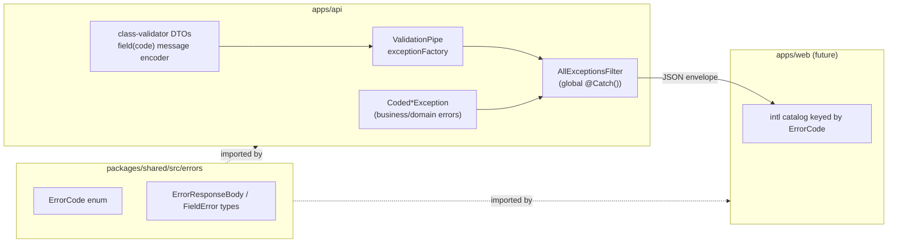

# Error handling — design reference

How `apps/api` reports errors to clients: one JSON envelope for every error,
carrying a stable machine-readable `code` (never translated prose) plus
`params` for interpolation, so `apps/web` can render a localized message
without parsing English sentences. Field-level validation errors attribute
each failure to the DTO field it came from. Full rationale and the
call-site-by-call-site retrofit lives in
`docs/superpowers/specs/2026-07-30-error-format-design.md`; this doc is the
as-designed reference, kept in sync with what ships.

## 1. Shape of the system



`ErrorCode` and the envelope's TypeScript types live in `packages/shared` so
neither app can drift from the other — the API can only throw a code that
exists in the enum, and the frontend's translation catalog is keyed off the
same type.

## 2. The envelope

Every error response, regardless of what threw it, has this shape:

```json
{
  "error": {
    "code": "AUTH_INVALID_CREDENTIALS",
    "message": "Invalid email or password",
    "params": {}
  }
}
```

`message` is an English fallback for logs and non-web API consumers — the
frontend never renders it directly. Validation failures add a `fields` map,
keyed by DTO property name, of the individual rule failures on that field:

```json
{
  "error": {
    "code": "VALIDATION_FAILED",
    "message": "Validation failed",
    "params": {},
    "fields": {
      "password": [
        { "code": "MIN_LENGTH", "message": "password must be at least 12 characters", "params": { "min": 12 } }
      ]
    }
  }
}
```

## 3. Throwing a domain error

A small set of `Coded*Exception` classes in `apps/api/src/common/errors/`
mirror the NestJS built-ins already in use (`CodedUnauthorizedException`,
`CodedBadRequestException`, `CodedNotFoundException`,
`CodedConflictException`, `CodedForbiddenException`), each requiring an
`ErrorCode` and message:

```ts
throw new CodedUnauthorizedException(
  ErrorCode.AUTH_INVALID_CREDENTIALS,
  'Invalid email or password',
);
```

## 4. Validation errors

class-validator only retains an already-interpolated message per failed
rule — not the rule's raw argument (e.g. the `12` in `MinLength(12)`). Each
decorator's `message` option is the one place that argument is still
available, so it's used to smuggle `{code, message, params}` out as JSON;
the human `message` (and how `params` are derived from the raw constraint
args) is authored once per code in a `FIELD_CODE_META` table in
`validation-field.ts`, so adding a new `field(...)` call site never
requires writing a message by hand:

```ts
@MinLength(12, { message: field(ErrorCode.MIN_LENGTH) })
password!: string;
```

`buildValidationException`, passed as the global `ValidationPipe`'s
`exceptionFactory`, decodes each constraint's message back into
`{code, message, params}` via `buildValidationFields` and groups them by
field into the `fields` map. A decorator added without `field(...)`
degrades to a best-effort code (derived from the class-validator
constraint name, e.g. `minLength` → `MIN_LENGTH`) instead of crashing the
request.

## 5. The global filter

`AllExceptionsFilter` (`@Catch()`, registered via `configureApp()` in
`apps/api/src/bootstrap.ts`, which `main.ts` calls) is the only place
that produces a response body for a thrown error:

1. A `Coded*Exception` → its body already has `{code, message, params}` (and
   `fields` for validation) → wrapped as `{ error: {...} }`.
2. Any other `HttpException` not yet carrying a code (framework-thrown,
   e.g. Nest's 404 for an unmatched route) → falls back to a synthesized
   `HTTP_<status>` code, so the shape is consistent even for paths that
   were missed.
3. Anything that isn't an `HttpException` (a genuine bug) → logged with
   full detail server-side, returned to the client as a generic
   `INTERNAL_SERVER_ERROR` — the real message and stack never reach the
   response.

## 6. Frontend contract

`apps/web` doesn't have auth/storefront UI yet, so nothing consumes this
today — this is the contract it's built against: read `error.code`, look it
up in an intl catalog keyed by the shared `ErrorCode` type, interpolate
`error.params`. For `VALIDATION_FAILED`, walk `error.fields[name]` per form
control. An unrecognized code (deploy skew between the two apps) falls back
to one generic message rather than throwing.

## Related

- `.agents/skills/backend-engineer/SKILL.md` — general backend conventions
  this design follows (module boundaries, testing conventions).
- `docs/architecture/authentication.md` — the auth flow whose ~30 existing throw
  sites this design retrofits.
- `docs/architecture/orders.md` — commerce domain error codes.
- `docs/architecture/products-and-categories.md` — product catalog error codes.
- `docs/architecture/carts-and-addresses.md` — cart and address error codes.
