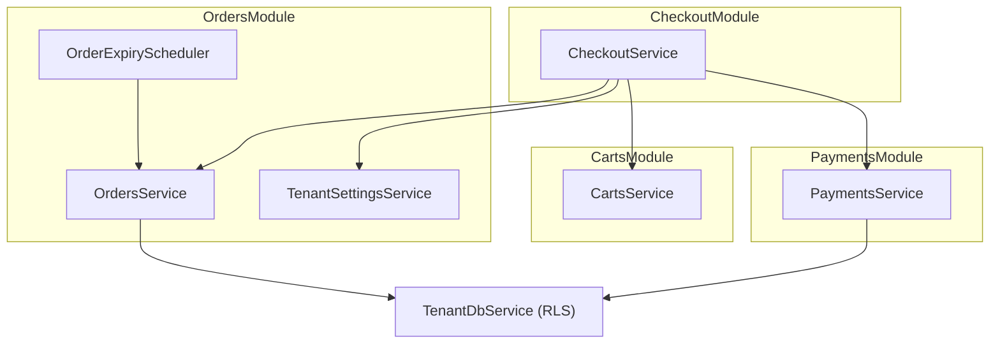
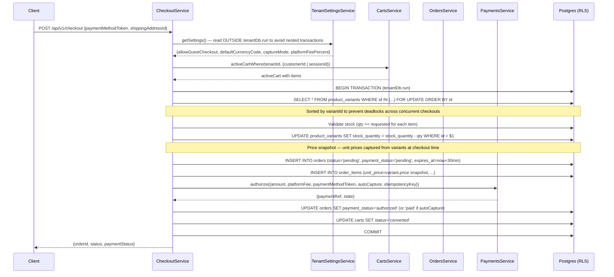
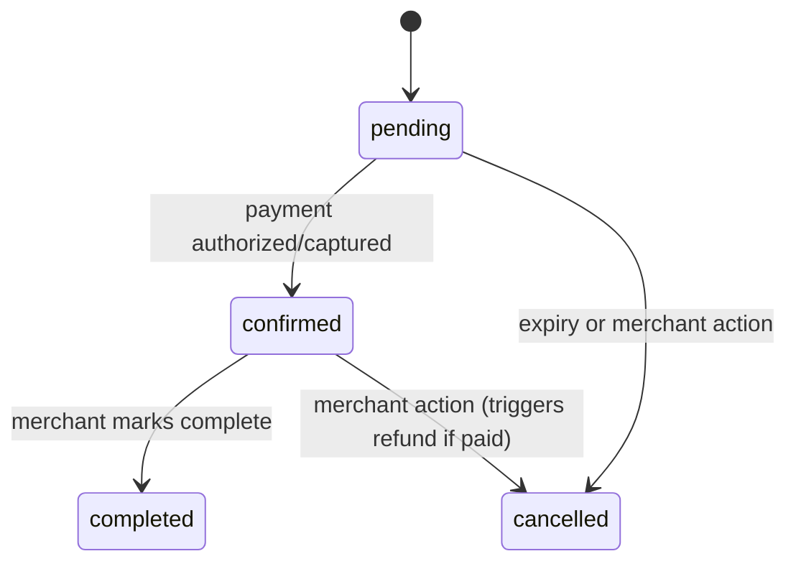
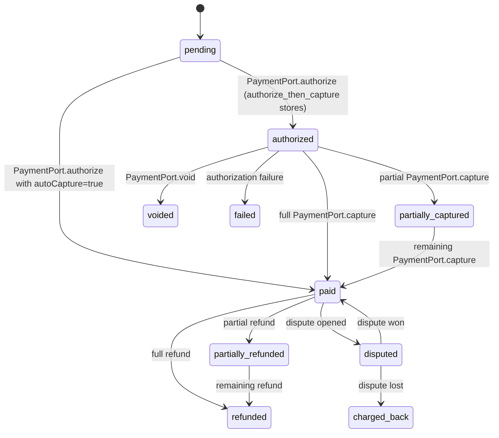
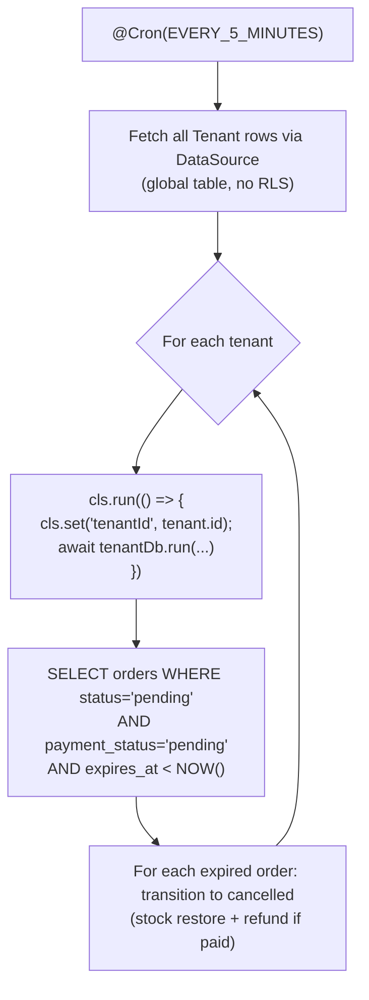

# Orders — design reference

As-built reference for the checkout flow, order lifecycle, order expiry, and
guest order access in `apps/api`. See `docs/architecture/payments.md` for the
payment engine this feeds into, and `docs/architecture/architecture.md` for
the multi-tenancy foundation.

## 1. Shape of the system



## 2. Tenant settings

`TenantSettings` is a singleton per tenant — there is exactly one row per
tenant in the `tenant_settings` table (unique index on `tenant_id`).

| Column | Type | Description |
|---|---|---|
| `allowGuestCheckout` | `boolean` | Whether unauthenticated checkout is permitted |
| `defaultCurrencyCode` | `text` | ISO-4217 currency code for this tenant |
| `captureMode` | `enum` | `immediate` or `authorize_then_capture` |
| `platformFeePercent` | `numeric` | Platform fee percentage (0–100). **Not merchant-writable.** |

`getSettings()` uses an idempotent upsert — `INSERT ... ON CONFLICT (tenant_id)
DO NOTHING` — so the first call for a new tenant creates the row with defaults;
subsequent calls return the existing row. This means the service never returns
`null`.

`platformFeePercent` is guarded at the service level: only platform operators
can set it. A merchant admin attempting to write this field receives a `403
Forbidden`. Merchant-facing `UpdateTenantSettingsDto` deliberately excludes
this field.

## 3. Checkout flow



**Nested transaction avoidance:** `getSettings()` reads from a global
(non-tenant-scoped) `TenantSettings` table. It must be called *before*
`tenantDb.run()` opens the checkout transaction — calling it inside would
attempt to nest a second `tenantDb.run` (which opens its own transaction),
causing a deadlock or incorrect transaction semantics.

**Stock lock ordering:** `FOR UPDATE` row locks on `product_variants` are
acquired in ascending `id` order across all items. This prevents deadlocks when
two concurrent checkouts race over the same variants in different orders.

**Price snapshot:** `order_items.unit_price` is set from `product_variant.price`
at checkout time and never updated. Subsequent price changes do not affect
existing orders.

## 4. Order state sub-machines

An order carries three independently-evolving state columns:

### Lifecycle (`status`)



### Payment (`payment_status`)



### Fulfillment (`fulfillment_status`)

Derived from `shipments` — not a state machine driven by explicit transitions,
but a computed value updated whenever a shipment is recorded:

```
unfulfilled → partially_fulfilled → fulfilled
```

`deriveFulfillmentStatus(orderedItems, shipments)` is a pure function in
`payments.md §7`. When all order items are covered by at least one shipment
row, the order is `fulfilled`.

`expiresAt` is set to `now() + 30 minutes` at order creation and cleared to
`null` when `payment_status` reaches `paid` (the order is no longer
expirable).

## 5. Order events

Every state transition writes an append-only row to `order_events`:

```
order_events (tenant_id, id, order_id, type, payload, occurred_at, provider_event_id)
```

The `type` column records the event kind (e.g. `payment.authorized`,
`order.cancelled`). `provider_event_id` is `NULL` for internally-triggered
transitions and carries the payment provider's event ID for webhook-driven
ones. A unique index on `(tenant_id, provider_event_id)` (filtering out
`NULL`) makes every payment webhook idempotent — a replayed event fails
the insert and the handler returns `{ received: true, status: 'already_processed' }`.

## 6. Cancellation side-effects

When an order transitions to `cancelled`, the following side-effects run
atomically in the same transaction:

1. **Stock restoration.** `product_variants` are locked `FOR UPDATE` (sorted by
   `variantId`, same ordering discipline as checkout) and quantities incremented.
2. **Automatic refund** (if `payment_status = 'captured'` or `'paid'`).
   `PaymentsService.refundPayment` is called within the same transaction.
   `payment_status` is set to `refunded` in the same commit.

Attempting to cancel an order in `completed` status throws
`ORDER_CANNOT_BE_CANCELLED`.

## 7. Guest order access

Unauthenticated customers can retrieve their own order status via a one-time
token issued at checkout:

- At checkout, a random opaque token is generated.
- Its SHA-256 hash is stored in `orders.guest_access_token_hash`.
- The raw token is returned to the client once in the checkout response.
- `GET /api/v1/orders/guest/:token` looks up the order by token hash using
  a **constant-time comparison** (`timingSafeEqual` from Node.js `crypto`) to
  prevent timing-oracle attacks.

Guest checkout is only permitted when `TenantSettings.allowGuestCheckout = true`.
Attempting guest checkout on a tenant with this disabled throws
`GUEST_CHECKOUT_DISABLED`.

## 8. Order expiry scheduler



The scheduler reads `Tenant` rows via the raw `DataSource` (the `tenants` table
is global, outside RLS). For each tenant it re-establishes the CLS context with
`cls.run(() => { cls.set('tenantId', id) })` before calling `tenantDb.run` —
this is the same pattern background jobs must always follow (see
`database-conventions.md §7`).

Never share one `tenantDb.run` across multiple tenants in a loop — each tenant
must have its own CLS scope.

## 9. API surface

### Customer endpoints

| Method | Path | Auth | Description |
|---|---|---|---|
| `POST` | `/api/v1/checkout` | Optional JWT or guest session | Submit checkout |
| `GET` | `/api/v1/orders` | Customer JWT | List own orders |
| `GET` | `/api/v1/orders/:id` | Customer JWT | Get order detail |
| `GET` | `/api/v1/orders/guest/:token` | None (guest token) | Get guest order status |

### Merchant admin endpoints

| Method | Path | Roles | Description |
|---|---|---|---|
| `GET` | `/api/v1/merchant-admins/orders` | any | List all orders (paginated, filterable) |
| `GET` | `/api/v1/merchant-admins/orders/:id` | any | Get order detail |
| `PATCH` | `/api/v1/merchant-admins/orders/:id/confirm` | `owner`, `admin`, `staff` | Confirm order |
| `PATCH` | `/api/v1/merchant-admins/orders/:id/complete` | `owner`, `admin`, `staff` | Mark complete |
| `PATCH` | `/api/v1/merchant-admins/orders/:id/cancel` | `owner`, `admin` | Cancel order |
| `GET` | `/api/v1/merchant-admins/settings` | any | Get tenant settings |
| `PATCH` | `/api/v1/merchant-admins/settings` | `owner` | Update tenant settings |

## 10. Error codes

| Code | When |
|---|---|
| `ORDER_NOT_FOUND` | Order ID not found in this tenant |
| `ORDER_EXPIRED` | Order `expiresAt` has passed |
| `ORDER_CANNOT_BE_CANCELLED` | Order is in `completed` status |
| `INVALID_ORDER_STATUS_TRANSITION` | Requested transition is not in `VALID_TRANSITIONS` |
| `GUEST_CHECKOUT_DISABLED` | Tenant settings disallow guest checkout |
| `CART_EMPTY` | Active cart has no items |
| `INSUFFICIENT_STOCK` | Variant stock < requested quantity |

## Related

- `docs/architecture/architecture.md` — tenancy model and RLS
- `docs/architecture/payments.md` — payment port, settlement split, webhook
- `docs/architecture/carts-and-addresses.md` — cart model and `activeCartWhere`
- `docs/architecture/products-and-categories.md` — variant stock and pricing
- `docs/architecture/database-conventions.md` — background job tenancy pattern
- `docs/architecture/error-handling.md` — error envelope format
- `.agents/skills/backend-engineer/SKILL.md` — operating rules
