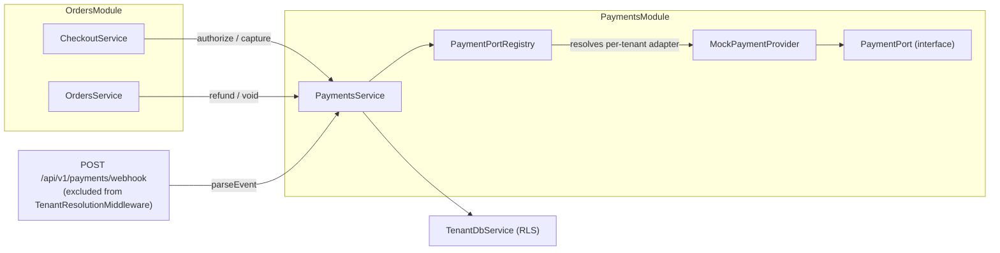
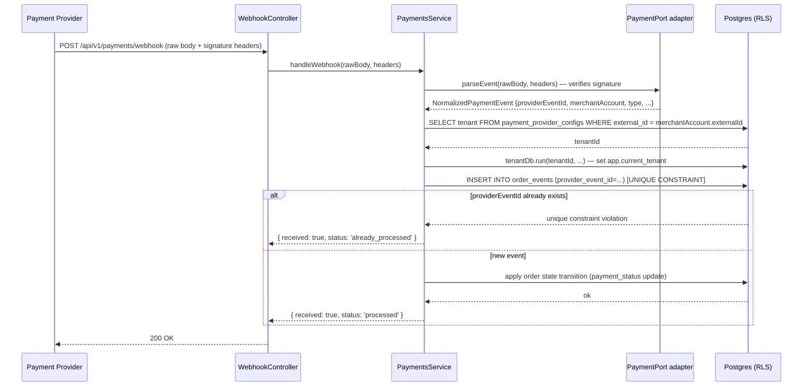

# Payments — design reference

As-built reference for the payment engine in `apps/api`. See
`docs/architecture/orders.md` for the checkout flow and order state machines
that drive payment events, and `docs/architecture/architecture.md` for the
vendor-abstraction pattern this port follows.

## 1. Shape of the system



The `PaymentPort` interface is the domain contract. `MockPaymentProvider`
is the only adapter currently wired. `PaymentPortRegistry` resolves the
adapter for a given tenant — adding a real provider means adding one adapter
class and one registry binding; no domain code changes.

## 2. Money value object

All monetary values use a `Money` value object — never raw numbers:

```ts
interface Money {
  amount: number;   // non-negative integer, MINOR units (cents, pence, etc.)
  currency: string; // uppercase ISO-4217, e.g. 'USD', 'GBP'
}
```

`MoneyUtil` provides:
- `create(amount, currency)` — validates non-negative integer, normalises
  currency to uppercase
- `add(a, b)` — asserts same currency
- `subtract(a, b)` — asserts same currency, throws if result is negative

The integer minor-unit representation avoids floating-point rounding errors
across all arithmetic. Currency is always uppercase — `MoneyUtil.create`
normalises on construction.

## 3. `PaymentPort` contract

```ts
interface Money { amount: number; currency: string }            // integer MINOR units
interface ProviderRef { provider: string; externalId: string }  // we persist this
type MerchantAccountRef = ProviderRef;
type PaymentRef = ProviderRef;

interface PaymentPort {
  createMerchantAccount(i: { tenantId: string; profile: BusinessProfile; idempotencyKey: string }): Promise<MerchantAccountRef>;
  createOnboardingSession(a: MerchantAccountRef, returnUrl: string): Promise<{ url: string; expiresAt: Date }>;
  getOnboardingStatus(a: MerchantAccountRef): Promise<'pending'|'needs_information'|'active'|'rejected'|'disabled'>;

  authorize(i: {
    merchantAccount: MerchantAccountRef; amount: Money; platformFee: Money;
    paymentMethodToken: string; orderId: string;
    autoCapture: boolean;                 // true on immediate_capture stores
    idempotencyKey: string;
  }): Promise<{ paymentRef: PaymentRef; state: 'authorized'|'captured'|'failed'; authExpiresAt?: Date }>;

  capture(i: { payment: PaymentRef; amount?: Money; idempotencyKey: string }): Promise<{ state: 'partially_captured'|'captured'; capturedTotal: Money }>; // omit amount = remaining
  void(payment: PaymentRef, idempotencyKey: string): Promise<void>;
  refund(i: { payment: PaymentRef; amount?: Money; refundPlatformFee: boolean; reason?: string; idempotencyKey: string }): Promise<{ refundRef: ProviderRef; refundedTotal: Money }>;

  parseEvent(raw: Buffer, headers: Record<string, string>): Promise<NormalizedPaymentEvent>;
}

interface NormalizedPaymentEvent {
  providerEventId: string;              // → unique(tenant_id, provider_event_id)
  type: 'payment.authorized'|'payment.captured'|'payment.refunded'
      | 'payment.dispute.opened'|'payment.dispute.won'|'payment.dispute.lost'
      | 'payout.paid'|'merchant_account.updated';
  merchantAccount: MerchantAccountRef;  // → resolve tenant, then withTenant(...)
  payment?: PaymentRef;
  occurredAt: Date;
}
```

Key design decisions:
- `autoCapture: boolean` on `authorize` maps to the tenant's `captureMode`
  setting (`immediate` → `true`, `authorize_then_capture` → `false`).
- `amount` on `capture` and `refund` is optional — omitting it means "full
  remaining amount".
- `refundPlatformFee` on `refund` allows the platform fee to be clawed back
  in dispute or goodwill scenarios.
- `parseEvent` receives the raw `Buffer` body and all HTTP headers so adapters
  can verify webhook signatures before parsing.

## 4. Settlement split

At checkout, the platform fee is calculated and passed to `authorize`:

```
platformFeeCents = floor(totalAmountCents × platformFeePercent / 100)
merchantAmountCents = totalAmountCents - platformFeeCents
```

Integer division truncates (rounds toward zero) — the merchant receives any
rounding benefit. The `settlements` table records both amounts per order for
reconciliation.

`platformFeePercent` is guarded at the service level to be within `[0, 100]`.
Any value outside this range throws a `VALIDATION_FAILED` error at the
`TenantSettings` update endpoint — the field is not merchant-writable (see
`orders.md §2`).

## 5. Refund rules

- `amountCents` must be a **positive integer**, enforced at both the DTO layer
  (`@IsInt() @Min(1)`) and the service layer (a guard that throws
  `VALIDATION_FAILED` if the value slips through).
- The refund amount cannot exceed the originally captured amount. Attempting
  to over-refund throws `REFUND_EXCEEDS_PAYMENT`.
- A partial refund sets `payment_status = 'partially_refunded'`.
- A full refund sets `payment_status = 'refunded'`.
- The `refunds` table records each refund action with its amount, reason, and
  the `ProviderRef` returned by the adapter.

## 6. Webhook endpoint

`POST /api/v1/payments/webhook` is excluded from `TenantResolutionMiddleware`
(see `architecture.md` for the exclusion list rationale). The raw `Buffer`
body is preserved and passed to `parseEvent`.

Webhook processing flow:



The `unique(tenant_id, provider_event_id)` index on `order_events` is the
idempotency mechanism — a replayed webhook with the same `providerEventId`
fails the insert constraint, and the handler returns `already_processed`
without re-applying the state transition.

## 7. Shipments

| Entity | Table | Notable columns |
|---|---|---|
| `Shipment` | `shipments` | `orderId`, `carrier`, `trackingNumber`, `shippedAt`, `deliveredAt` |
| `ShipmentItem` | `shipment_items` | `shipmentId`, `orderItemId`, `quantity` |

Both tables are tenant-scoped with composite PKs `(tenant_id, id)`.

`deriveFulfillmentStatus(orderedItems, shipments)` is a **pure function** —
it takes the order's item list and all shipment records (already loaded) and
returns `unfulfilled | partially_fulfilled | fulfilled`. It performs no DB
queries.

Whenever a new shipment is recorded, `OrdersService` re-runs
`deriveFulfillmentStatus` and updates `Order.fulfillmentStatus` in the same
transaction. This keeps the column in sync without a DB trigger.

## 8. `MockPaymentProvider`

`MockPaymentProvider` implements `PaymentPort` for development and tests:

- `authorize`: always returns `state: 'authorized'` for token `tok_valid`;
  returns `state: 'failed'` for `tok_decline`; sets `autoCapture` state to
  `'captured'` when true.
- `capture`, `void`, `refund`: succeed unconditionally with plausible
  `ProviderRef` values.
- `parseEvent`: verifies the `x-mock-signature` header (HMAC-SHA256 of the
  raw body with a test secret). Returns a `NormalizedPaymentEvent` from the
  JSON body.
- `PaymentPortRegistry`: resolves `MockPaymentProvider` for any tenant that
  does not have a real provider configured.

## 9. API surface

| Method | Path | Auth | Description |
|---|---|---|---|
| `POST` | `/api/v1/payments/webhook` | None (signature-verified) | Receive provider webhook event |
| `POST` | `/api/v1/merchant-admins/orders/:id/refund` | `owner`, `admin` | Trigger manual refund |
| `POST` | `/api/v1/merchant-admins/shipments` | `owner`, `admin`, `staff` | Record a shipment |

## 10. Error codes

| Code | When |
|---|---|
| `PAYMENT_FAILED` | Provider returns `state: 'failed'` from `authorize` |
| `REFUND_EXCEEDS_PAYMENT` | Refund amount > captured amount |

## Related

- `docs/architecture/architecture.md` — ports & adapters pattern, `PaymentPort` interface
- `docs/architecture/orders.md` — checkout flow, order state machines, webhook idempotency key
- `docs/architecture/database-conventions.md` — entity base classes, RLS pattern
- `docs/architecture/error-handling.md` — error envelope format
- `.agents/skills/backend-engineer/SKILL.md` — operating rules
