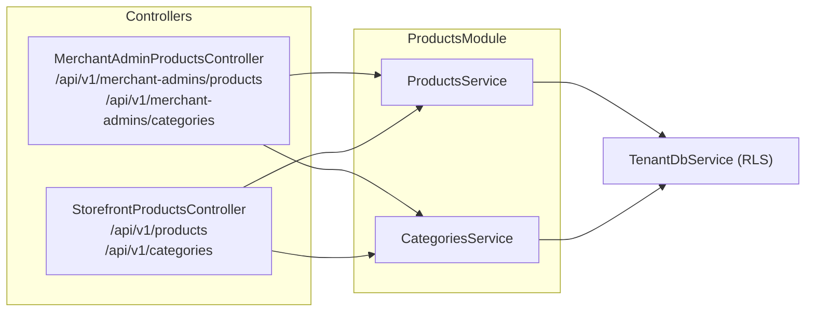

# Products & Categories — design reference

As-built reference for how the product catalog works in `apps/api`. See
`docs/architecture/architecture.md` for the multi-tenancy and RLS foundations
this module builds on, and `.agents/skills/backend-engineer/SKILL.md` for the
operating rules.

## 1. Shape of the system

Merchant admin endpoints require a valid `MerchantAdminJwtAuthGuard` JWT and
appropriate `@Roles(...)`. Storefront endpoints are public — no auth required.

## 2. Entities

| Entity | Table | Notable columns | RLS |
|---|---|---|---|
| `Product` | `products` | `status` (`draft\|active\|archived`), `name`, `description`, `basePrice` (numeric, cents) | ✓ |
| `ProductVariant` | `product_variants` | `sku`, `price` (numeric, cents), `stockQuantity`, `isDefault`, `productId` | ✓ |
| `Category` | `categories` | `name`, `slug`, `parentId` (nullable, self-referential) | ✓ |
| `ProductCategory` | `product_categories` | `productId`, `categoryId` (join table) | ✓ |

All four tables are tenant-scoped: composite primary key `(tenant_id, id)`,
and composite foreign keys — e.g. `product_variants.productId` references
`(tenant_id, id)` on `products` — making cross-tenant references physically
impossible at the DB level.

`basePrice` and `price` are stored as integer cents in a `numeric` PostgreSQL
column. The TypeORM entity uses a `transformer: { from: v => Number(v) }` to
avoid the driver's string-coercion behaviour.

## 3. Product status gating

Products have three statuses:

| Status | Merchant admin can see | Storefront can see | Meaning |
|---|---|---|---|
| `draft` | ✓ | ✗ | Work-in-progress, not yet published |
| `active` | ✓ | ✓ | Publicly listed |
| `archived` | ✓ | ✗ | Soft-deleted — hidden from storefront, retained for order history |

Storefront read queries always apply `WHERE status = 'active'` in addition to
the RLS tenant filter. Deleting a product is not supported — use `archived`
instead. This preserves referential integrity with `order_items`.

## 4. Variant rules

Every product must have at least one variant. The rules enforced at the service
layer:

- **At least one variant required.** `CreateProductDto` accepts an optional
  `variants` array; if omitted or empty, a single default variant is created
  automatically with `sku = 'SKU-<uuid8>'` and the product's `basePrice`. Deleting
  the only variant of a product (via bulk update or single-variant `DELETE`) is rejected with `VALIDATION_FAILED`.
- **Exactly one `isDefault` variant.** If the caller provides variants, exactly
  one must have `isDefault: true`. For single-variant endpoints (`POST` or `PATCH`), setting `isDefault: true`
  automatically demotes the previous default variant (`isDefault = false`) within the transaction. Unsetting `isDefault: false` on the sole default variant without promoting another throws `VALIDATION_FAILED`.
- **Default auto-promotion on delete.** Deleting the default variant via `DELETE /api/v1/merchant-admins/products/:productId/variants/:variantId` automatically promotes the oldest remaining variant (ordered by `createdAt ASC`) to default within the transaction.
- **SKU uniqueness is per-tenant.** A unique index on `(tenant_id, sku)` on
  `product_variants` enforces this at the DB level; the service surfaces
  constraint violations as `DUPLICATE_RESOURCE`.
- **Product scope & tenant isolation.** Single-variant operations verify that both `:productId` and `:variantId` belong to the active tenant and that the variant is owned by the specified product. If `:variantId` does not belong to `:productId`, `RESOURCE_NOT_FOUND` is thrown.
- **Bulk replace & single-variant endpoints.** In addition to bulk update via
  `UpdateProductDto.variants`, fine-grained single-variant endpoints under `/api/v1/merchant-admins/products/:productId/variants` allow creating (`POST`), listing (`GET`), inspecting (`GET /:variantId`), patching (`PATCH /:variantId`), and deleting (`DELETE /:variantId`) individual product variants.

## 5. Category tree

`CategoriesService.getCategoryTree()` returns the full category hierarchy as a
nested tree. The implementation:

1. Fetches all `Category` rows for the tenant (flat list, one query).
2. Builds an in-memory `Map<id, CategoryTreeNode>` where each node holds its
   `children` array.
3. Returns the roots (nodes whose `parentId` is `null`).

No recursive CTE is used — category counts are expected to stay in the
hundreds, where an in-memory tree construction is simpler and fast enough.

Guards enforced at the service layer:

- **No circular parentage.** Setting `parentId` to the category's own `id`
  throws `VALIDATION_FAILED`.
- **No deletion of non-leaf categories.** A category with children cannot be
  deleted; the caller must re-parent or delete the children first.

## 6. API surface

### Merchant admin endpoints (require JWT + role)

| Method | Path | Roles | Description |
|---|---|---|---|
| `POST` | `/api/v1/merchant-admins/products` | `owner`, `admin`, `staff` | Create product with variants |
| `GET` | `/api/v1/merchant-admins/products` | any | List products (all statuses, paginated) |
| `GET` | `/api/v1/merchant-admins/products/:id` | any | Get product by ID |
| `PATCH` | `/api/v1/merchant-admins/products/:id` | `owner`, `admin`, `staff` | Update product |
| `PATCH` | `/api/v1/merchant-admins/products/:id/archive` | `owner`, `admin` | Archive product |
| `POST` | `/api/v1/merchant-admins/products/:productId/variants` | `owner`, `admin` | Add single variant to product |
| `GET` | `/api/v1/merchant-admins/products/:productId/variants` | any | List variants of product |
| `GET` | `/api/v1/merchant-admins/products/:productId/variants/:variantId` | any | Get single variant by ID |
| `PATCH` | `/api/v1/merchant-admins/products/:productId/variants/:variantId` | `owner`, `admin` | Update single variant (stock, price, SKU, default) |
| `DELETE` | `/api/v1/merchant-admins/products/:productId/variants/:variantId` | `owner`, `admin` | Delete single variant (auto-promotes default) |
| `POST` | `/api/v1/merchant-admins/categories` | `owner`, `admin`, `staff` | Create category |
| `GET` | `/api/v1/merchant-admins/categories` | any | Get full category tree |
| `PATCH` | `/api/v1/merchant-admins/categories/:id` | `owner`, `admin`, `staff` | Update category |
| `DELETE` | `/api/v1/merchant-admins/categories/:id` | `owner`, `admin` | Delete leaf category |

### Storefront endpoints (public)

| Method | Path | Description |
|---|---|---|
| `GET` | `/api/v1/products` | List active products (paginated) |
| `GET` | `/api/v1/products/:id` | Get active product by ID |
| `GET` | `/api/v1/categories` | Get full category tree (active products only) |

## 7. Error codes

| Code | When |
|---|---|
| `RESOURCE_NOT_FOUND` | Product or category ID not found in tenant, or variant ID does not belong to specified product |
| `VALIDATION_FAILED` | Invalid variant config, circular parentage, bad field value, deleting sole variant, or unsetting only default variant |
| `DUPLICATE_RESOURCE` | SKU already exists in this tenant |

## Related

- `docs/architecture/architecture.md` — tenancy model and RLS
- `docs/architecture/carts-and-addresses.md` — carts reference `product_variants`
- `docs/architecture/orders.md` — order items snapshot variant prices
- `docs/architecture/error-handling.md` — error envelope format
- `.agents/skills/backend-engineer/SKILL.md` — operating rules

