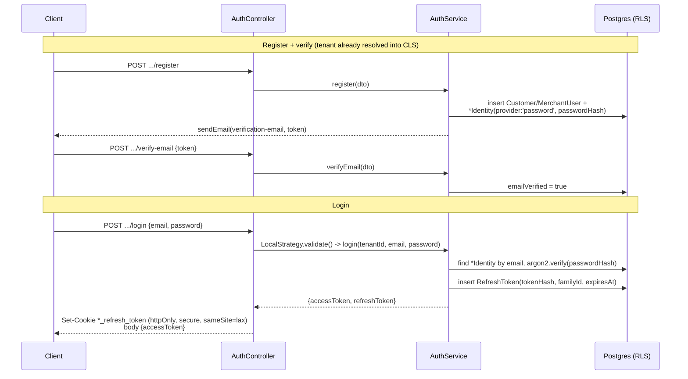
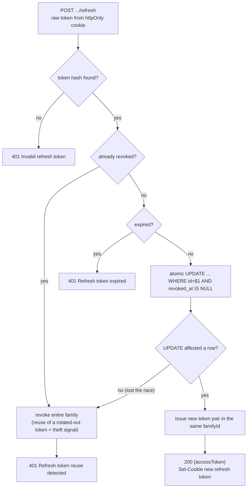
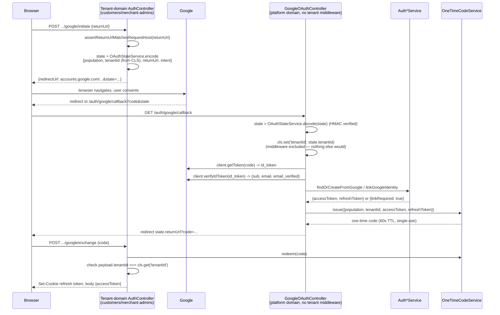
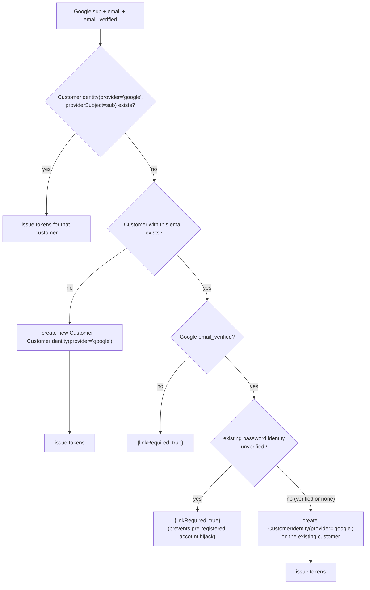

# Authentication — current flow

As-built reference for how authentication actually works in `apps/api` today. `docs/AuthDesign.md` is the pre-implementation spec that guided the build; this doc describes what shipped, and calls out where it diverged. See `.claude/skills/backend-engineer/SKILL.md` for the tenancy-isolation rules (RLS, `withTenant`) this flow depends on.

## 1. Shape of the system

Two populations, each with a complete, independent auth surface, sharing a small set of primitives:

```mermaid
flowchart LR
    subgraph shared["auth-core (shared primitives)"]
        TS["TokenService<br/>sign/verify JWT"]
        HS["HashingService<br/>argon2id"]
        OS["OAuthStateService<br/>HMAC-signed state"]
        RC["refresh-token-crypto<br/>opaque token + sha256 hash"]
        RU["return-url<br/>open-redirect guard"]
    end

    subgraph customers["customers/ (storefront)"]
        CAC["CustomersAuthController"]
        CAS["CustomersAuthService"]
        CJS["CustomerJwtStrategy"]
        CLS_["CustomerLocalStrategy"]
    end

    subgraph merchants["merchant-admins/ (dashboard)"]
        MAC["MerchantAdminsAuthController"]
        MAS["MerchantAdminsAuthService"]
        MJS["MerchantAdminJwtStrategy"]
        MLS["MerchantAdminLocalStrategy"]
        RG["RolesGuard + @Roles"]
    end

    subgraph oauth["oauth/ (centralized Google callback)"]
        GOC["GoogleOAuthController<br/>/auth/google/callback"]
        OTC["OneTimeCodeService<br/>60s single-use code"]
    end

    customers --> shared
    merchants --> shared
    oauth --> shared
    oauth --> customers
    oauth --> merchants
```

Both populations are **tenant-scoped**: `Customer`/`CustomerIdentity`/`CustomerRefreshToken` and `MerchantUser`/`MerchantUserIdentity`/`MerchantUserRefreshToken` all extend `ImmutableTenantEntityBase` and live under RLS with a composite `(tenant_id, ...)` uniqueness. This is a deliberate deviation from `docs/AuthDesign.md` §0/§2, which specified merchant/staff accounts as **platform-global** with a many-to-many `tenant_membership` table — that was never built. In the shipped design, a merchant admin's `role` (`owner | admin | staff | viewer`, see `role-hierarchy.ts`) is a plain column on `MerchantUser`, and there's no cross-tenant identity or "active tenant switch"; a merchant admin account only ever exists inside one tenant.

There's no global `APP_GUARD` and no `@Public()` decorator — guards (`CustomerJwtAuthGuard`, `MerchantAdminJwtAuthGuard`, `RolesGuard`) are applied per-route with `@UseGuards(...)`; a route with none of those is implicitly public.

All routes are served under URI versioning (`apps/api/src/bootstrap.ts`, `app.enableVersioning({ type: VersioningType.URI, defaultVersion: API_VERSION })`) plus a global `/api` prefix (`app.setGlobalPrefix(API_PREFIX, ...)`), so `CustomersAuthController`/`MerchantAdminsAuthController` routes live under `/api/v1/...` — e.g. `POST /api/v1/customers/auth/login`. The refresh-token cookies' `path` (`REFRESH_COOKIE_PATH` in each controller) is built from the same `API_ROUTE_PREFIX` constant (`apps/api/src/common/constants.ts`) so it can't drift from the route it's scoped to. `GET /` and `GET /auth/google/callback` are excluded from both the prefix and versioning (`version: VERSION_NEUTRAL`), so their paths are unaffected — see §2 for why.

## 2. Prerequisite: tenant resolution

Almost every request needs a resolved tenant before auth logic can run, because `TenantDbService.run()` (`withTenant`) reads `tenant_id` exclusively from CLS and throws if it's unset.

`TenantResolutionMiddleware` (`apps/api/src/common/middleware/tenant-resolution.middleware.ts:25-44`) is mounted `forRoutes('*')` and, for every request, looks up the lowercased `Host` header against `tenants.host` and calls `cls.set('tenantId', tenant.id)`. Unknown host → `404`.

Two routes are excluded from it (see the backend-engineer skill for the full rationale): `GET /auth/google/callback` (a platform-domain route — seeds CLS itself from the signed OAuth `state`, §5 below) and `GET /` (health probe). Any other route excluded from this middleware would have an **unvalidated** `req.hostname` and must not use it as a security input — this is exactly what `return-url.ts` depends on (§5).

## 3. Password auth lifecycle

Identical shape for both populations (`customers-auth.service.ts` / `merchant-admins-auth.service.ts`); the one structural difference is that merchant-admin `register()` requires redeeming a valid, unexpired, single-use `MerchantUserInvite` (issued by an existing `owner`/`admin` via `POST /api/v1/merchant-admins/auth/invite`, guarded by `RolesGuard` + `@Roles('owner','admin')`, itself checked against `roleOutranks()` so an `admin` can't invite an `owner`) — customers self-register freely.

Password reset (`request-password-reset` / `reset-password`) always performs the same DB round-trips and always sends the same email regardless of whether the address is registered — a deliberate anti-enumeration measure (comment at `customers-auth.service.ts:391-398`). A successful reset revokes **every** refresh token for that account.

## 4. Refresh token rotation & reuse detection

Refresh tokens are **opaque** random values (`generateOpaqueRefreshToken`, `refresh-token-crypto.ts`), never JWTs — only their sha256 hash is stored, alongside a `familyId` used for rotation and theft detection (`customers-auth.service.ts:178-234`, mirrored in the merchant-admin service):

The conditional `UPDATE ... WHERE revoked_at IS NULL` closes a race where two concurrent `refresh()` calls with the same raw token both pass the checks above before either commits — only one `UPDATE` can match, the other is treated as reuse (comment at `customers-auth.service.ts:205-225`).

## 5. JWT structure & guards

Access tokens are short-lived JWTs (`expiresIn: '15m'`, hardcoded — not env-driven), signed with one shared `JWT_SECRET` across **all** tenants (`auth-core/services/token.service.ts`):

| Population | `aud` | Payload |
|---|---|---|
| Customer | `'customer'` | `{ sub: customerId, aud, tenantId }` |
| Merchant admin | `'merchant_admin'` | `{ sub: merchantUserId, aud, tenantId, role }` |

Because the secret is shared, `CustomerJwtStrategy`/`MerchantAdminJwtStrategy` (`customer-jwt.strategy.ts:24-38`) can't rely on the signature alone to prove tenancy — they additionally reject with `401 Token tenant mismatch` if `payload.tenantId !== cls.get('tenantId')`, i.e. the token's tenant must match the tenant `TenantResolutionMiddleware` resolved from *this* request's own host. `RolesGuard` (`merchant-admins/guards/roles.guard.ts`) runs after the JWT guard and checks `request.user.role` against `@Roles(...)` metadata on the handler.

## 6. Google OAuth flow

Google requires an exact-match registered redirect URI, which rules out one callback per tenant subdomain — so there is a **single centralized callback** on the platform domain, and the tenant travels through a signed `state` parameter instead.

The token pair is never put in a redirect URL (proxies/history/Referer would log it) — the callback hands off via a short-lived, single-use, tenant-bound one-time code (`OneTimeCodeService`, in-memory, 60s TTL — needs a shared store like Redis for a multi-instance deployment), and the tenant-domain `.../google/exchange` endpoint redeems it and additionally re-checks `payload.tenantId` against its own CLS tenant, so a code can't be redeemed against a different tenant within its TTL.

### Account-linking decision (customer)

`findOrCreateFromGoogle` (`customers-auth.service.ts:252-356`) — customers can self-provision via Google, merchant admins cannot:

`linkRequired: true` sends the client to the deliberate `POST .../google/link/initiate` (JWT-guarded — the customer authenticates with their password first) → `linkGoogleIdentity`, which skips the `email_verified` gate entirely since the caller is already an authenticated principal, and only refuses if that Google identity is already linked to a *different* customer (`ConflictException`).

**Merchant admins differ**: `MerchantAdminsAuthService.findOrCreateFromGoogle` (`merchant-admins-auth.service.ts:277-360`) has no "create" branch at all — accounts are provisioned only via the invite flow (§3), so Google login either finds a matching identity/verified account or throws `404 No merchant admin account found for this email`. There is also no merchant-admin link-initiate endpoint (see the comment at `merchant-admins-auth.controller.ts:159-161`).

## 7. Environment variables

All validated at boot via `class-validator` (`apps/api/src/config/env.validation.ts:36-54`); an unset value fails startup rather than silently degrading (see the comment on `GoogleOAuthController`'s constructor for what an unset `PLATFORM_BASE_URL` would otherwise do to the redirect URI).

| Variable | Purpose |
|---|---|
| `JWT_SECRET` | Signs/verifies access tokens (`JwtModule.registerAsync`, shared across all tenants) |
| `OAUTH_STATE_SECRET` | HMAC key for the signed OAuth `state` param (`OAuthStateService`) |
| `GOOGLE_OAUTH_CLIENT_ID` / `GOOGLE_OAUTH_CLIENT_SECRET` | Google OAuth2 client credentials (`OAuth2Client`, authorize-URL builders) |
| `PLATFORM_BASE_URL` | Base URL used to construct the single registered `redirect_uri` (`${PLATFORM_BASE_URL}/auth/google/callback`) |

Documented with example values in `.env.example` (repo root).
